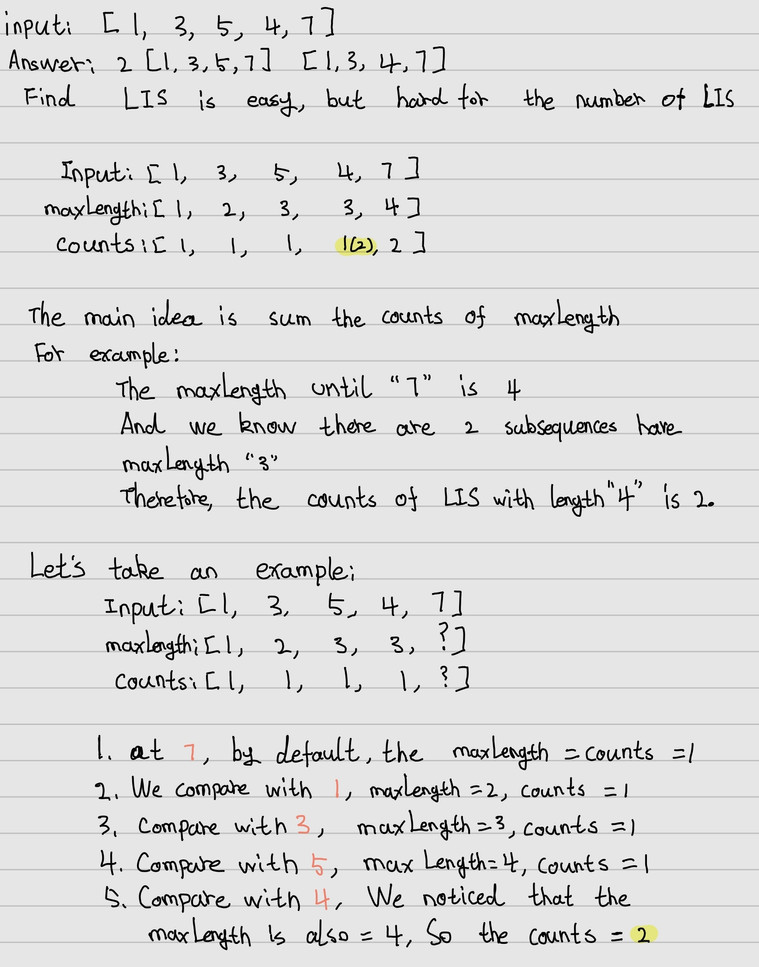

___
[673. Number of Longest Increasing Subsequence](https://leetcode.com/problems/number-of-longest-increasing-subsequence/)
___

## 基本思路
* This is a really hard question.
* 

___

`Time complexity : O(n^2)`

`Space complexity : O(n)`
```python
class Solution:
    def findNumberOfLIS(self, nums: List[int]) -> int:
        length = len(nums)
        dp = {}
        maxLength = subsequences = 0
        
        for i in range(length):
            currentMaxLength = currentSubsequences = 1
            
            for j in range(0, i):
                if nums[i] > nums[j]:
                    length, count = dp[j]
                    if length + 1 == currentMaxLength:
                        currentSubsequences += count
                    elif length + 1 > currentMaxLength:
                        currentMaxLength, currentSubsequences = length + 1, count
            
            if currentMaxLength > maxLength:
                maxLength, subsequences = currentMaxLength, currentSubsequences
            elif maxLength == currentMaxLength:
                subsequences += currentSubsequences
            dp[i] = (currentMaxLength, currentSubsequences)
        
        print(dp)
        return subsequences
```