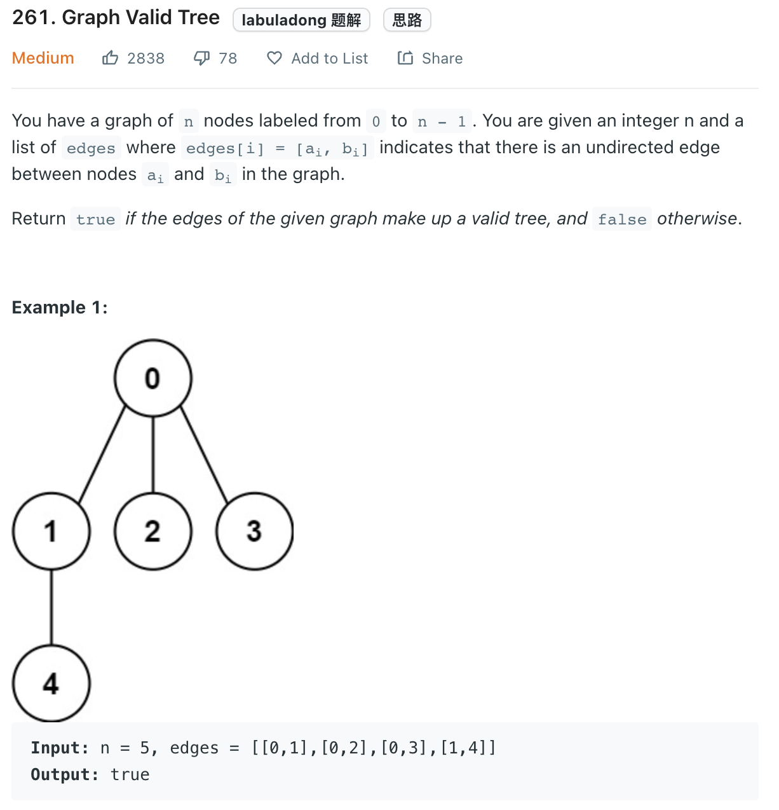
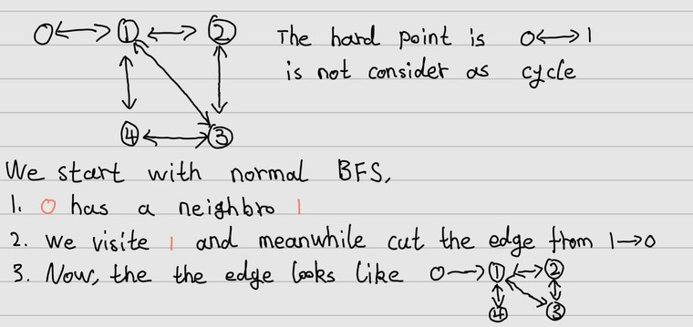

___
[261. Graph Valid Tree](https://leetcode.com/problems/graph-valid-tree/)
___


## 基本思路
* In short, this question is asking to detect cycle in an undirected graph.
* How do we detect cycle in an undirected graph?
* There are two ways of using BFS.
* 
* Once we see a `fromNode` contains `toNode` and `toNode` contains `fromNode`, we remove the edge of `toNode -> fromNode`

* Second way is using a HashMap to store the parent of each `toNode`
* For example `0 -> 1` and `1 -> 0`
* We starting with fromNode `0`, and we see `1` is the toNode.
* We add `1` into our HashMap. `parent[1] = 0`
* Next round we meet fromNode `1`, and `0` is the toNode.
* We can check `parent[fromNode] == toNode`
___

`Time complexity : O(n)`

`Space complexity : O(n)`
```python
class Solution:
    def validTree(self, n: int, edges: List[List[int]]) -> bool:
        graph = defaultdict(set)
        for fromNode, toNode in edges:
            graph[fromNode].add(toNode)
            graph[toNode].add(fromNode)

        queue = collections.deque()
        visited = set()
        queue.append(0)
        visited.add(0) 
        
        while queue:
            fromNode = queue.popleft()
            for toNode in graph[fromNode]:
                if toNode in visited:
                    return False
                queue.append(toNode)
                visited.add(toNode)
                graph[toNode].remove(fromNode)
                
        return len(visited) == n
```

___


```python
class Solution:
    def validTree(self, n: int, edges: List[List[int]]) -> bool:
        trees = defaultdict(list)
        for fromNode, toNode in edges:
            trees[fromNode].append(toNode)
            trees[toNode].append(fromNode)
        parent = {}
        queue = collections.deque()
        parent[0] = -1
        queue.append(0)
        
        while queue:
            fromNode = queue.popleft()
            for toNode in trees[fromNode]:
                if parent[fromNode] == toNode:
                    continue
                if toNode in parent:
                    return False
                queue.append(toNode)
                parent[toNode] = fromNode
                
        return len(parent) == n
```