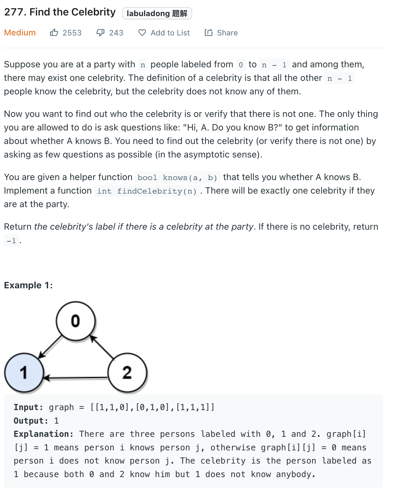
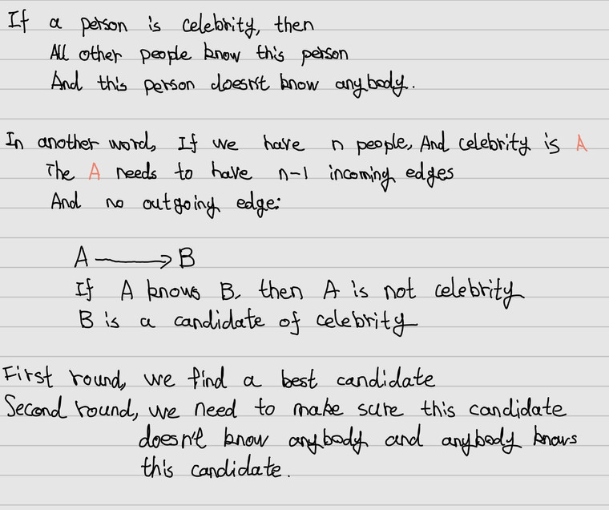

___
[277. Find the Celebrity](https://leetcode.com/problems/find-the-celebrity/)
___

## 基本思路
* 

___

`Time complexity : O(n)`

`Space complexity : O(1)`
```python
# The knows API is already defined for you.
# return a bool, whether a knows b
# def knows(a: int, b: int) -> bool:

class Solution:
    def findCelebrity(self, n: int) -> int:
        candidate = 0
        
        for person in range(1, n):
            if knows(candidate, person):
                candidate = person
        for person in range(n):
            if person == candidate: continue
            else:
                if knows(candidate, person) or not knows(person, candidate):
                    return -1
        
        return candidate
```