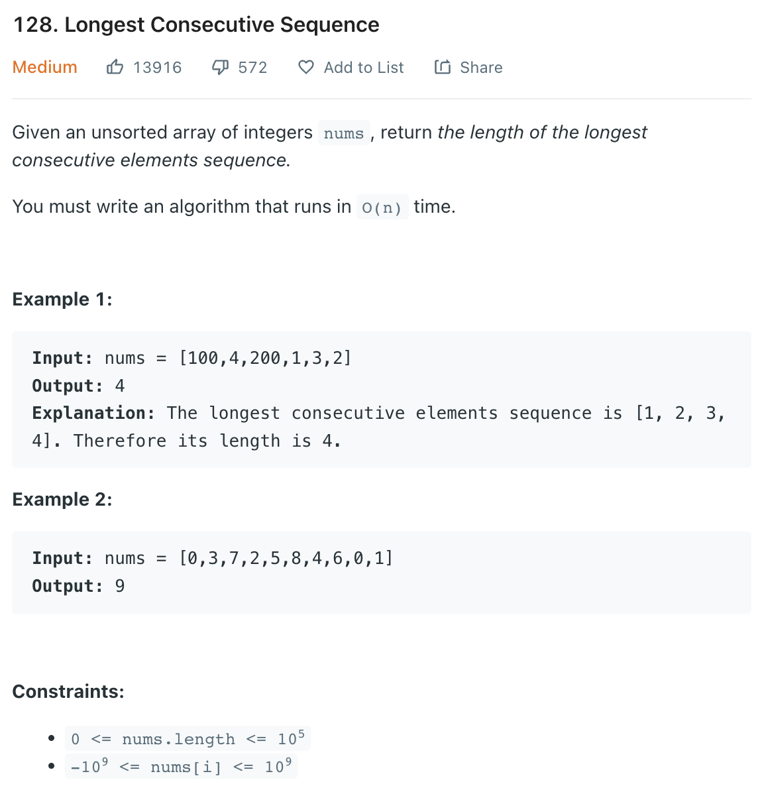

___
[128. Longest Consecutive Sequence](https://leetcode.com/problems/longest-consecutive-sequence/)
___

## 分析问题
* We can use brute force or sorting to solve this question.
* But a better idea is using Hash_Table

## 基本思路
* Put all `nums` into `num_set`
* For each `num` in `nums` `if num - 1 not in num_set:` we find the answer 1 by 1
* `if num - 1 not in num_set:` is really important.
* It will reduce us a lot of time

___

`Time complexity : O(n)`

`Space complexity : O(n)`
```python
class Solution:
    def longestConsecutive(self, nums: List[int]) -> int:
        num_set = set(nums)
        answer = 0
        
        for num in num_set:
            if num - 1 not in num_set:
                current_num = num
                temp = 1
                while num + 1 in num_set:
                    num += 1
                    temp += 1
                answer = max(answer, temp)
        return answer
```