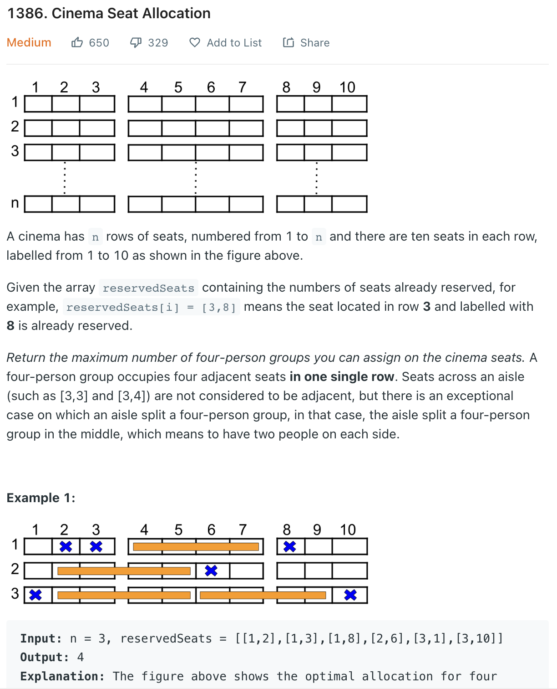

___
[1386. Cinema Seat Allocation](https://leetcode.com/problems/cinema-seat-allocation/)
___


## 基本思路
* This is not a good question.
* I copied from others

___

`Time complexity : O()`

`Space complexity : O()`
```java
class Solution {
    public int maxNumberOfFamilies(int n, int[][] reservedSeats) { 
        int result = 0;
        Map<Integer, List<Integer>> rowToSeatRes = new HashMap<>();
        
        for(int[] row : reservedSeats) {
            if(rowToSeatRes.containsKey(row[0])) {
                rowToSeatRes.get(row[0]).add(row[1]);
            } else {
                rowToSeatRes.put(row[0], new ArrayList<Integer>(Arrays.asList(row[1])));
            }
        }
		
        // System.out.println(rowToSeatRes);
        result = (n - rowToSeatRes.size()) * 2;         // These rows do not contain any reservations
        
       for(List<Integer> res : rowToSeatRes.values()) { // Check possible family seating in each row 
            boolean flag = false;
            
			// Check first possibility
            if(!res.contains(2) &&
              !res.contains(3) &&
              !res.contains(4) &&
              !res.contains(5)) {
                result++;
                flag = true;
            }
            
            // Check second possibility
            if(!res.contains(6) &&
              !res.contains(7) &&
              !res.contains(8) &&
              !res.contains(9)) {
                result++;
                flag = true;
            }
            
            // Check middle seats only if first two are not used
            if(!flag) {
                if(!res.contains(4) &&
                   !res.contains(5) &&
                   !res.contains(6) &&
                   !res.contains(7))
                result++;
            }
        }
        
        return result;
    }
}
```