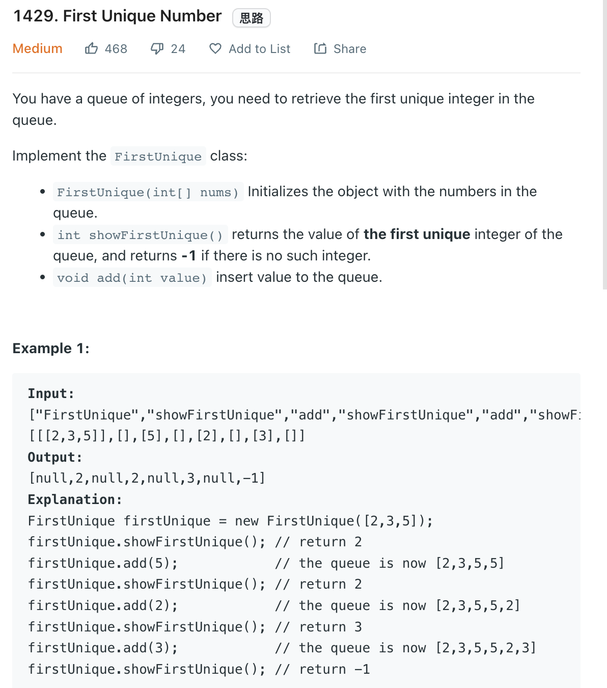

___
[1429. First Unique Number](https://leetcode.com/problems/first-unique-number/)
___

## 基本思路
* Having a `HashMap` and a `Queue`
* `HashMap` is storing if any element is unique or not
* First time seen is unique, second time seen is not.
* `Queue` is storing all first seen element
* When we want to show the first unique element
* We pop from `queue` and check if this element in `HashMap` unique or not.
* If not unique, we continue pop until we find the solution.

___

`Time complexity : O()`

`Space complexity : O()`
```python
    def __init__(self, nums: List[int]):
        self.is_unique = {}
        self.queue = collections.deque()
        for num in nums:
            self.add(num)
            
    def showFirstUnique(self) -> int:
        while self.queue and not self.is_unique[self.queue[0]]:
            self.queue.popleft()
        if self.queue:
            return self.queue[0]
        
        return -1

    def add(self, value: int) -> None:
        if value not in self.is_unique:
            self.is_unique[value] = True
            self.queue.append(value)
        else:
            self.is_unique[value] = False
```