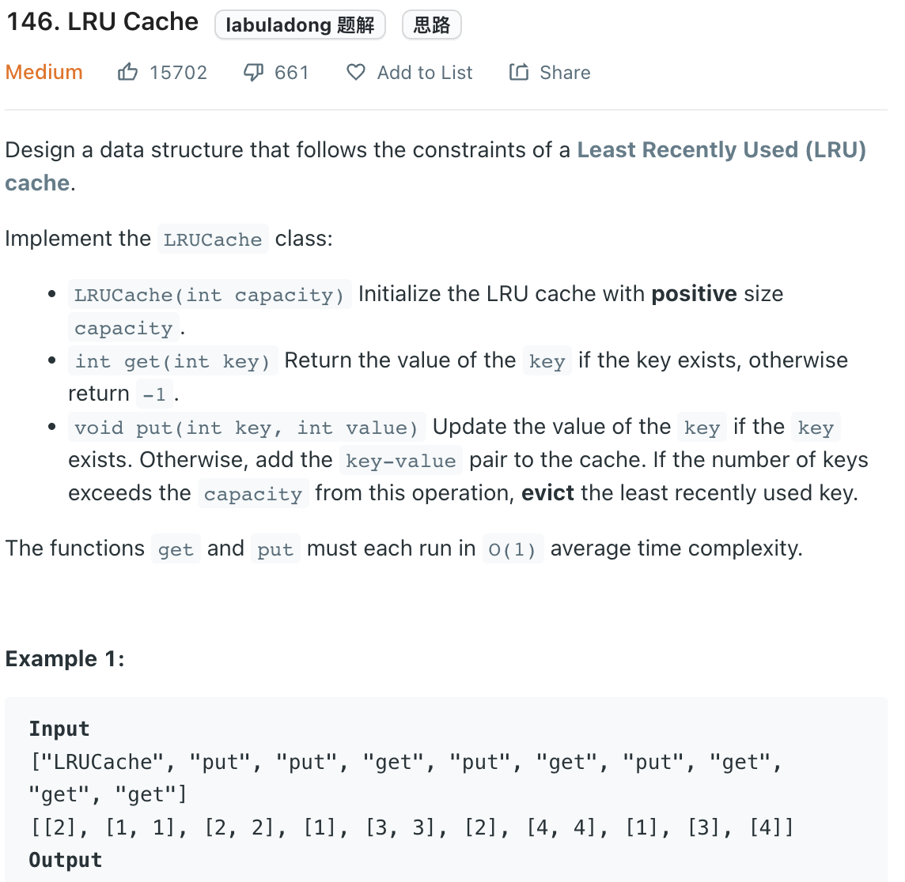

___
[146. LRU Cache](https://leetcode.com/problems/lru-cache/)
___


## 基本思路
* `Hashmap` + `DoubleLinkedList`.
* `Hashmap` is used to store the address of each (key, node)
* `DoubleLinkedList` is used to store the `data`, `previous` and `next`.
* It's same as `LinkedHashMap` and `OrderedDict`
* The main mission is to remove a node at any position.
* add a node at first.
___

`Time complexity : O(1)`

`Space complexity : O(capacity)`
```java
class Node {
    int key, val;
    Node previous;
    Node next;
    
    public Node(int key, int val) {
        this.key = key;
        this.val = val;
    }
    
    public Node() {
        
    }
}

class LRUCache {

    HashMap<Integer, Node> map;
    Node head;
    Node tail;
    int capacity;
    
    public LRUCache(int capacity) {
        this.capacity = capacity;
        this.map = new HashMap<>(capacity);
        this.head = new Node();
        this.tail = new Node();
        head.next = tail;
        tail.previous = head;
    }
    
    public int get(int key) {
        if (map.containsKey(key)) {
            Node current = map.get(key);
            removeNode(current);
            addNodeToFirst(current);
            return current.val;
        } else {
            return -1;
        }
    }
    
    public void put(int key, int value) {
        if (map.containsKey(key)) {
            Node current = map.get(key);
            removeNode(current);
            current.val = value;
            addNodeToFirst(current);
        } else {
            if (map.size() == capacity) {
                Node nodeNeedRemove = tail.previous;
                map.remove(nodeNeedRemove.key);
                removeNode(nodeNeedRemove); 
            }
            
            Node current = new Node(key, value);
            addNodeToFirst(current);
            map.put(key, current);
        }
    }
    
    public void addNodeToFirst(Node current) {
        Node next = head.next;
        head.next = current;
        current.previous = head;
        current.next = next;
        next.previous = current;
    }
    
    public void removeNode(Node current) {
        Node previous = current.previous;
        Node next = current.next;
        previous.next = next;
        next.previous = previous;
    }
}

/**
 * Your LRUCache object will be instantiated and called as such:
 * LRUCache obj = new LRUCache(capacity);
 * int param_1 = obj.get(key);
 * obj.put(key,value);
 */
```