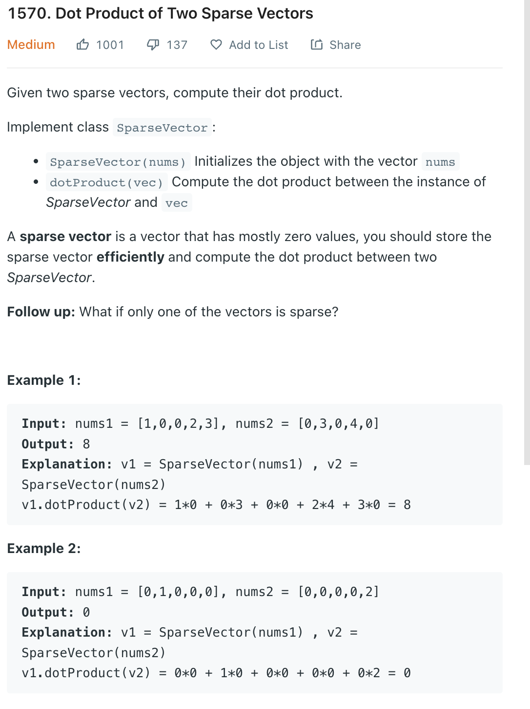

___
[1570. Dot Product of Two Sparse Vectors](https://leetcode.com/problems/dot-product-of-two-sparse-vectors/)
___


## 基本思路
* This is an easy question.
* Using brute force is also ok, but there is a way to save some space.
* We store all `nonZeros` index and it's value.


___

`L` the length of nonZeros

`Time complexity : O(n)`

`Space complexity : O(L)`
```python
class SparseVector:
    def __init__(self, nums: List[int]):
        self.nonZeros = {}
        
        for index, value in enumerate(nums):
            if value != 0:
                self.nonZeros[index] = value

    # Return the dotProduct of two sparse vectors
    def dotProduct(self, vec: 'SparseVector') -> int:
        result = 0
        
        for index, value in self.nonZeros.items():
            if index in vec.nonZeros:
                result += value * vec.nonZeros[index]
        
        return result
        

# Your SparseVector object will be instantiated and called as such:
# v1 = SparseVector(nums1)
# v2 = SparseVector(nums2)
# ans = v1.dotProduct(v2)
```