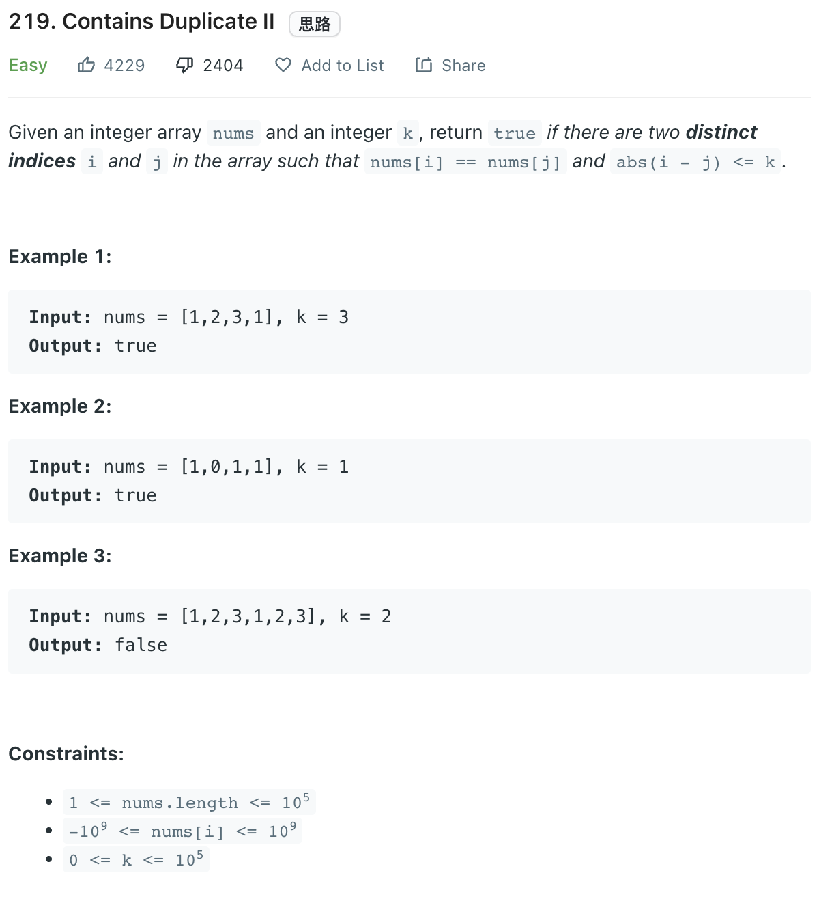

___
[219. Contains Duplicate II](https://leetcode.com/problems/contains-duplicate-ii/)
___

## 分析问题
* 

## 基本思路
* 

___

`Time complexity : O(n)`

`Space complexity : O(n)`
```python
class Solution:
    def containsNearbyDuplicate(self, nums: List[int], k: int) -> bool:
        dic = {}
        for i, num in enumerate(nums):
            if num in dic and i - dic[num] <= k:
                return True
            dic[num] = i
        return False
```