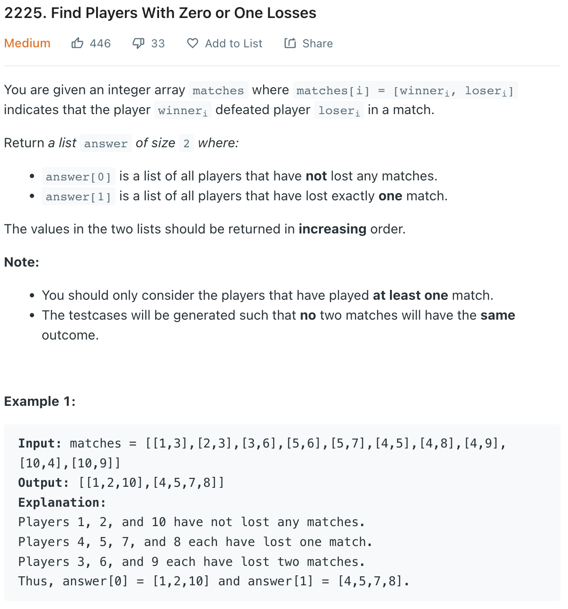

___
[2225. Find Players With Zero or One Losses](https://leetcode.com/problems/find-players-with-zero-or-one-losses/)
___


## 基本思路
* If we use HashMap, this question is an easy question.
* If we using counting sort, this question will be medium.

___

`Time complexity : O(nlog(n))`

`Space complexity : O(n)`
```python
class Solution:
    def findWinners(self, matches: List[List[int]]) -> List[List[int]]:
        winnerMap = {} 
        loserMap = {}
        winners = []
        losers = []
        for winner, loser in matches:
            winnerMap[winner] = winnerMap.get(winner, 0) + 1
            loserMap[loser] = loserMap.get(loser, 0) + 1
        
        for winner in winnerMap.keys():
            if winner not in loserMap:
                winners.append(winner)
        
        for loser, count in loserMap.items():
            if count == 1:
                losers.append(loser)
        
        return [sorted(winners), sorted(losers)]
```