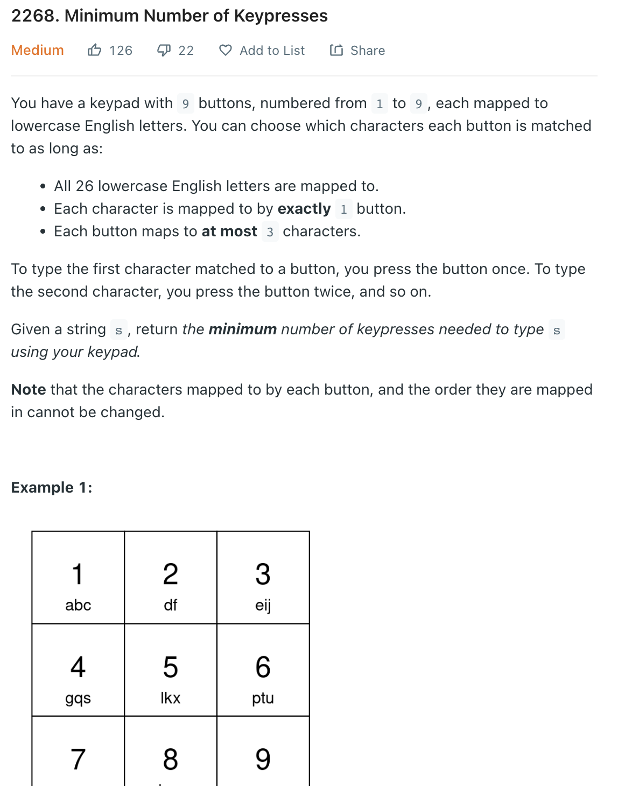
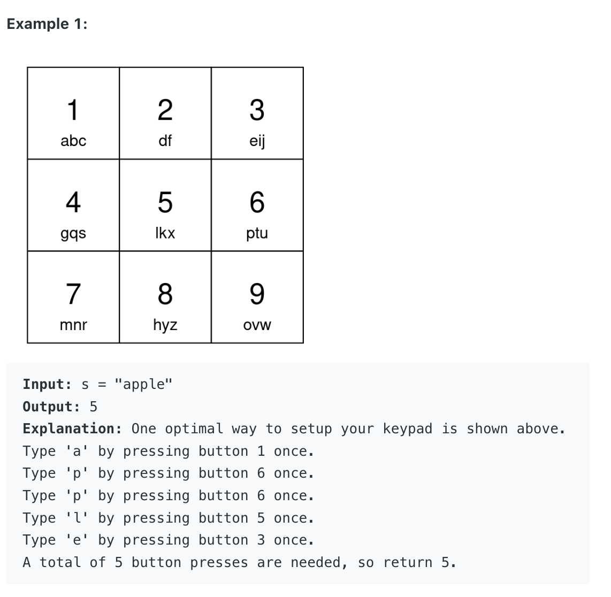

___
[2268. Minimum Number of Keypresses](https://leetcode.com/problems/minimum-number-of-keypresses/)
___


## 基本思路
* Instead of create the optimal `numpad`. We can find a pattern of it.
* Count the frequency of each `char` in `s`
* We want to keep the most appears char at the very first of each `numpad` and we only need to press ones for each occurence.

___

`Time complexity : O(n)`

`Space complexity : O(n)`
```python
class Solution:
    def minimumKeypresses(self, s: str) -> int:
        counts = collections.Counter(s)
        counts = dict(sorted(counts.items(), key=lambda x:x[1], reverse=True))
        answer = 0
        
        index = 1
        for _, frequency in counts.items():
            if 1 <= index <= 9:
                answer += frequency
            elif 10 <= index <= 18:
                answer += frequency * 2
            elif 19 <= index <= 26:
                answer += frequency * 3
            index += 1
        return answer
```