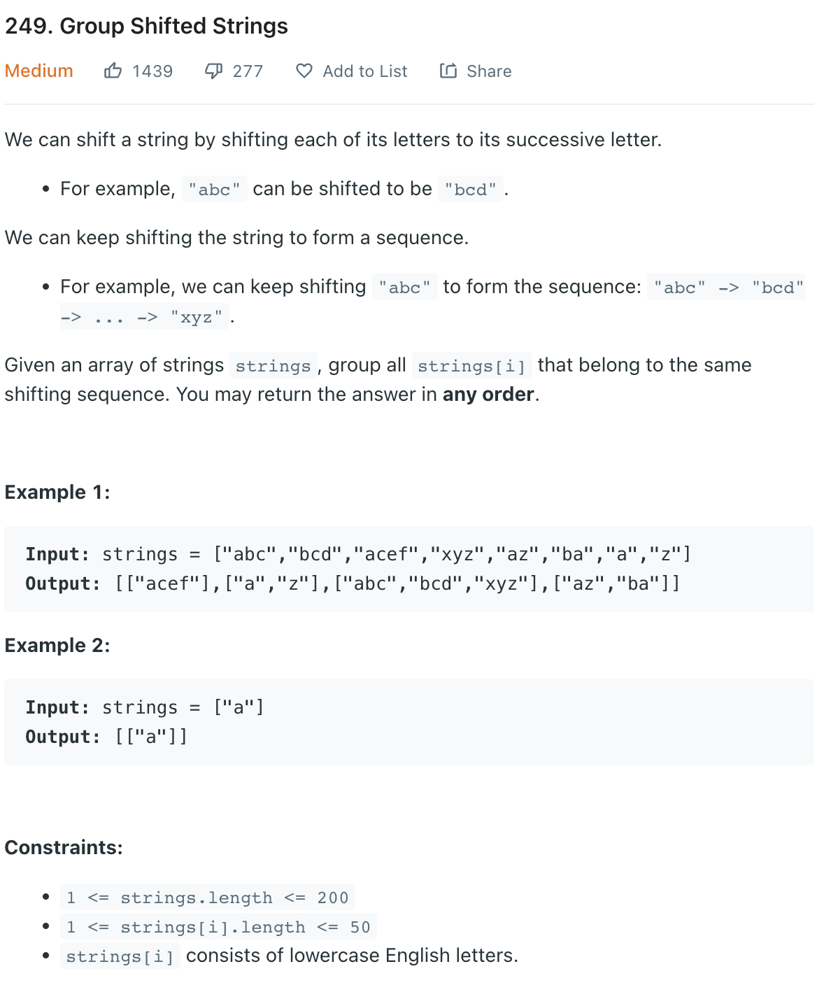

___
[249. Group Shifted Strings](https://leetcode.com/problems/group-shifted-strings/)
___


## 基本思路
* If we count the difference of each char at store into HashMap
* For example:
* `['az', 'ba']`
* For `az` the difference is 25, so the key is 25,
* For `ba` the difference is 25, so the key is 25,

___

`Time complexity : O(len(longest string) * n)`

`Space complexity : O(n)`
```python
class Solution:
    def groupStrings(self, strings: List[str]) -> List[List[str]]:
        pattern = defaultdict(list)
        
        def getKey(string):
            key = ""
            for i in range(1, len(string)):
                difference = ord(string[i]) - ord(string[0])
                if difference < 0:
                    difference += 26
                key += str(difference) + ','
            return key
        
        for s in strings:
            key = getKey(s)
            pattern[key].append(s)
            
        return [item for key, item in pattern.items()]
```