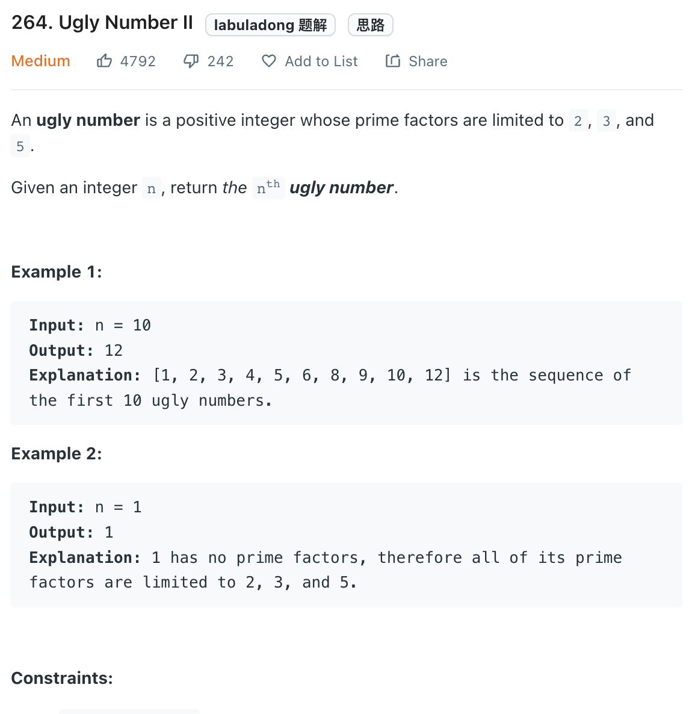

___
[264. Ugly Number II](https://leetcode.com/problems/ugly-number-ii/)
___


## 基本思路
* Having a min heap `heap` to store the smallest ugly number.
* Having a set `nums` to avoid duplicate calculation

___

`Time complexity : O()`

`Space complexity : O()`
```python
from heapq import heappush, heappop
class Solution:
    def nthUglyNumber(self, n: int) -> int:
        nums = set([1])
        heap = [1]
        ugly_number = 1
        
        for _ in range(n):
            ugly_number = heappop(heap)
            
            for factor in [2, 3, 5]:
                new_ugly_number = ugly_number * factor
                if new_ugly_number not in nums:
                    nums.add(new_ugly_number)
                    heappush(heap, new_ugly_number)
        
        return ugly_number
```