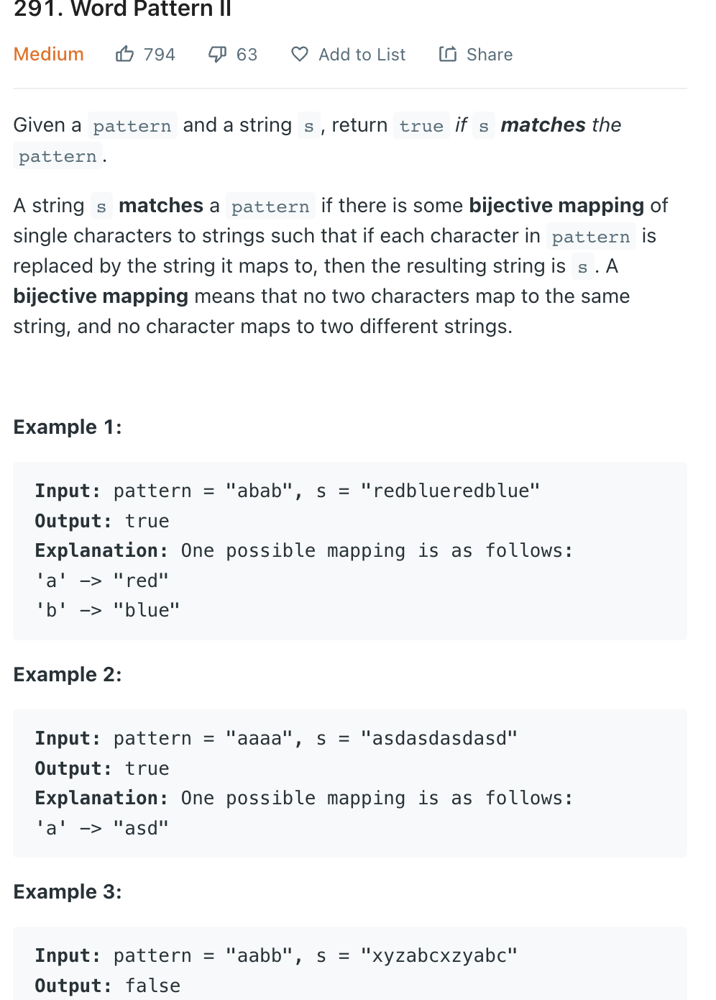
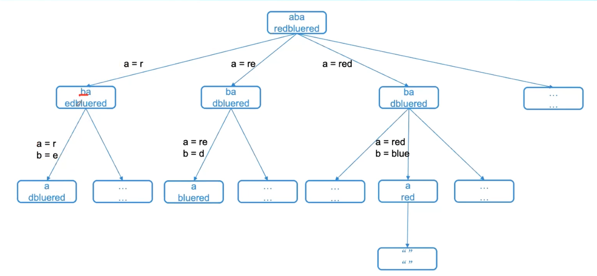

___
[291. Word Pattern II](https://leetcode.com/problems/word-pattern-ii/)
___


## 基本思路
* You are right
* The only way to solve this question is burte force.
* The diffcult part is if a word already has pattern, we just skip that word
* Take a look at following example
```
Input: pattern = "aabb", s = "xyzabcxzyabc"
Output: false
```


* If our pattern is `ab` and string is `zzzxxx`
* Try map[a] = z
* Try map[b] = z
* Try map[b] = zz [zzxxx]
* No.
* Then 
* Try map[a] = zz
* Try map[b] = z [zxxx]
* No.
* Then 
* Try map[a] = zzz
* Try map[b] = x [xxx]
* Yes


___

`Time complexity : O(?)`

`Space complexity : O(?)`
```python
class Solution:
    def wordPatternMatch(self, pattern: str, s: str) -> bool:
        
        def dfs(pattern, s, mapping, used) -> bool:
            if not pattern:
                return not s
            
            char = pattern[0]
            
            if char in mapping:
                word = mapping[char]
                
                if not s.startswith(word):
                    return False
                
                return dfs(pattern[1:], s[len(word):], mapping, used)
            
            for i in range(len(s)):
                word = s[:i+1]
                
                if word in used:
                    continue
                
                used.add(word)
                mapping[char] = word
                
                if dfs(pattern[1:], s[i + 1:], mapping, used):
                    return True
                
                used.remove(word)
                del mapping[char]
                
            return False
        return dfs(pattern, s, {}, set())
```