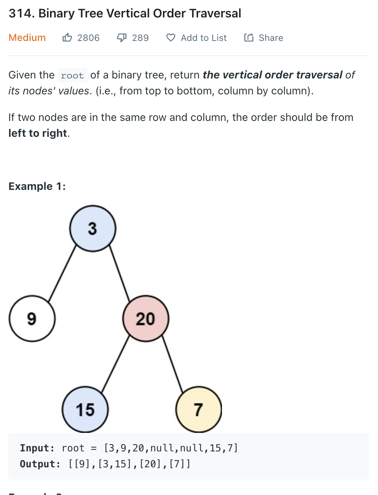

___
[314. Binary Tree Vertical Order Traversal](https://leetcode.com/problems/binary-tree-vertical-order-traversal/)
___

## 基本思路
* If we move to left child, the col will be -1 and the row will be +1.
* Keep this in mind.
* We create a Map called `dic`, the key is the col, the value is a pair (row, root.value).
* In this way, we can add the cooridinate of each node into our `dic`.
* And if we know the `minCol` and `maxCol`, we can easily traverse from left to right and even top to botton

___

`Time complexity : O(n)`

`Space complexity : O(n)`
```python
class Solution:
    def verticalOrder(self, root: Optional[TreeNode]) -> List[List[int]]:
        if not root:
            return []
        dic = defaultdict(list)
        minCol = maxCol = 0
        def dfs(root, col, row):
            nonlocal minCol, maxCol
            if not root:
                return
            minCol = min(minCol, col)
            maxCol = max(maxCol, col)
            dic[col].append((row, root.val))
            dfs(root.left, col - 1, row + 1)
            dfs(root.right, col + 1, row + 1)
        dfs(root, 0, 0)
        answer = []
        for i in range(minCol, maxCol + 1):
            dic[i].sort(key=lambda x:x[0])
            answer.append(value for _, value in dic[i])
        return answer
```