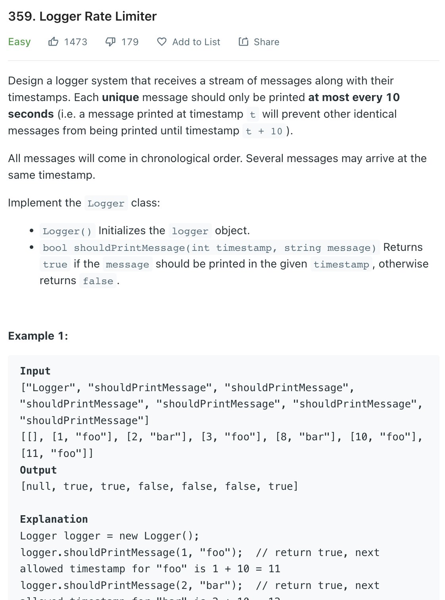

___
[359. Logger Rate Limiter](https://leetcode.com/problems/logger-rate-limiter/)
___


## 基本思路
* An easy HashMap question

___

`Time complexity : O(1)`

`Space complexity : O(n)`
```python
class Logger:

    def __init__(self):
        self.dic = {}

    def shouldPrintMessage(self, timestamp: int, message: str) -> bool:
        if message not in self.dic:
            self.dic[message] = timestamp + 10
            return True
        
        if self.dic[message] <= timestamp:
            self.dic[message] = timestamp + 10
            return True
        else:
            return False


# Your Logger object will be instantiated and called as such:
# obj = Logger()
# param_1 = obj.shouldPrintMessage(timestamp,message)
```