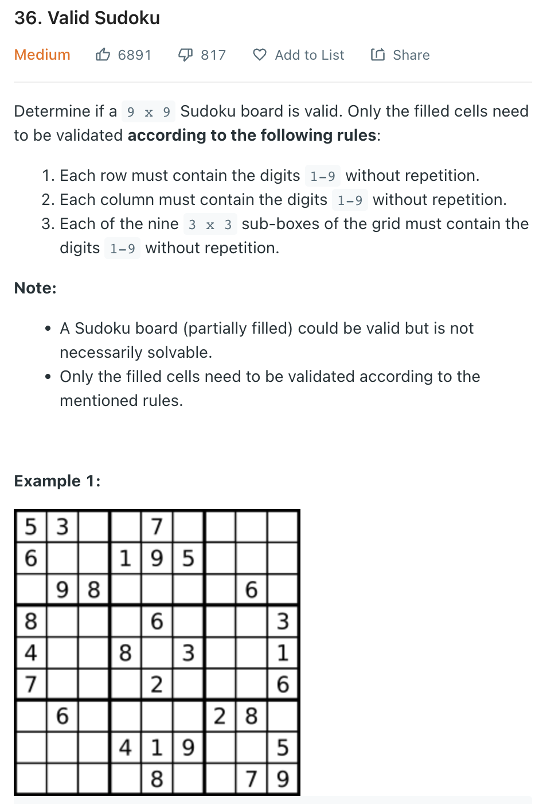

___
[36. Valid Sudoku](https://leetcode.com/problems/valid-sudoku/)
___

## 基本思路
* We have 9 `sets` for row, 9 `sets` for column and 9 `sets` for box.

___

`Time complexity : O(n^2)`

`Space complexity : O(n)`
```java
class Solution {
    public boolean isValidSudoku(char[][] board) {
        int length = 9;
        
        HashSet<Character>[] rows = new HashSet[length];
        HashSet<Character>[] cols = new HashSet[length];
        HashSet<Character>[] boxes = new HashSet[length];
        
        for (int i = 0; i < length; i++) {
            rows[i] = new HashSet<>();
            cols[i] = new HashSet<>();
            boxes[i] = new HashSet<>();
        }
        
        for (int row = 0; row < length; row++) {
            for (int col = 0; col < length; col++) {
                char c = board[row][col];
                if (c == '.') { continue; }
                
                int box = (row / 3) * 3 + col / 3;
                if (rows[row].contains(c) || cols[col].contains(c) || boxes[box].contains(c)) { return false; }
                rows[row].add(c);
                cols[col].add(c);
                boxes[box].add(c);
            }
        }
        return true;
    }
}
```