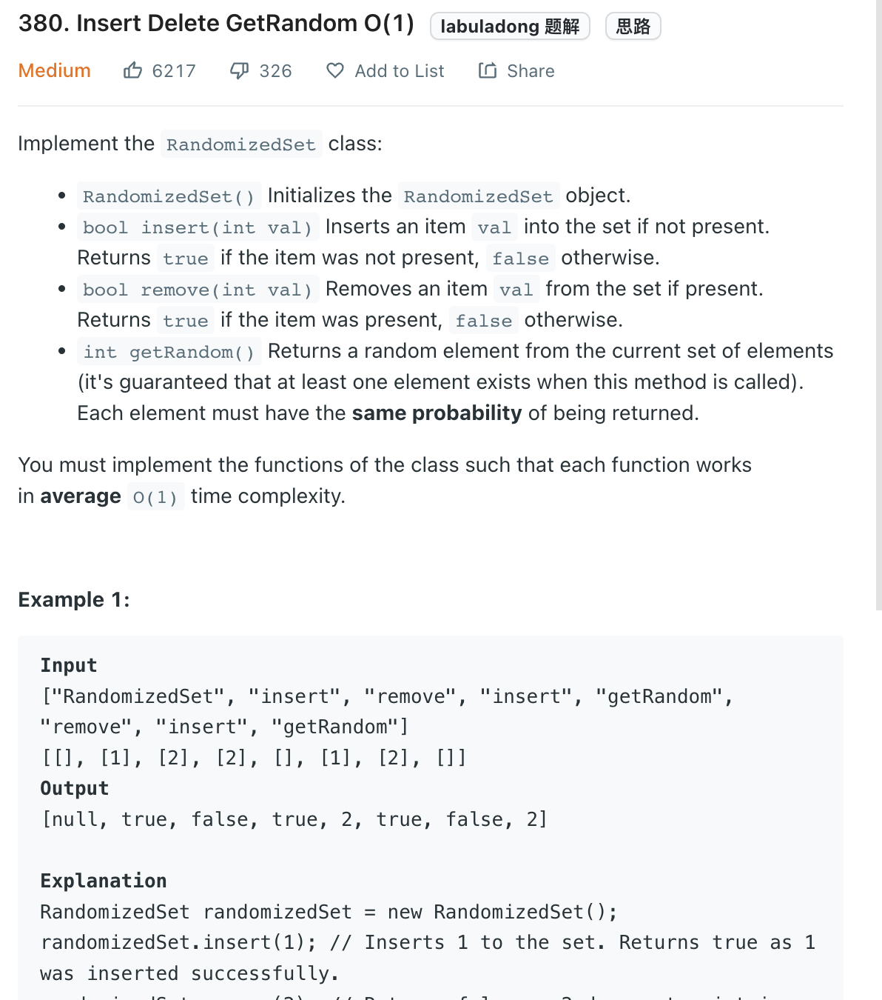

___
[380. Insert Delete GetRandom O(1)](https://leetcode.com/problems/insert-delete-getrandom-o1/)
___


## 基本思路
* `HashMap` is guarentee get and remove is O(1) but we are not able to random get with also O(1)
* So we can use `HashMap` and `ArrayList`
* The Key point right here is remove element from `ArrayList` is not O(1).
* Instead of remove element from `ArrayList`, we can swap the element with the last element from `ArraytList`.
* In this way, swap is O(1) and remove last element is also O(1).
* In order to make the swap, we need `HashMap` to store the index of each element.
* The key point is if there is only 1 element in the list, we want to make sure we can succsuffly remove this element from both `HashMap` and `ArrayList`

___

`Time complexity : O(1)`

`Space complexity : O(N)`
```java
class RandomizedSet {

    private HashMap<Integer, Integer> map;
    private List<Integer> list;
    private int index;
    private Random rand;
    
    public RandomizedSet() {
        map = new HashMap<>();
        list = new ArrayList<>();
        index = 0;
        rand = new Random();
    }
    
    public boolean insert(int val) {
        if (map.containsKey(val)) {
            return false;
        }
        list.add(val);
        map.put(val, index++);
        return true;
    }
    
    public boolean remove(int val) {
        if (!map.containsKey(val)) {
            return false;
        }
        int valIndex = map.get(val);
        int lastElement = list.get(index - 1);
        
        list.set(valIndex, lastElement);
        map.put(lastElement, valIndex);
        
        list.remove(--index);
        map.remove(val);
        return true;
    }
    
    public int getRandom() {
        int randomIndex = rand.nextInt(index); 
        return list.get(randomIndex);
    }
}

/**
 * Your RandomizedSet object will be instantiated and called as such:
 * RandomizedSet obj = new RandomizedSet();
 * boolean param_1 = obj.insert(val);
 * boolean param_2 = obj.remove(val);
 * int param_3 = obj.getRandom();
 */
```