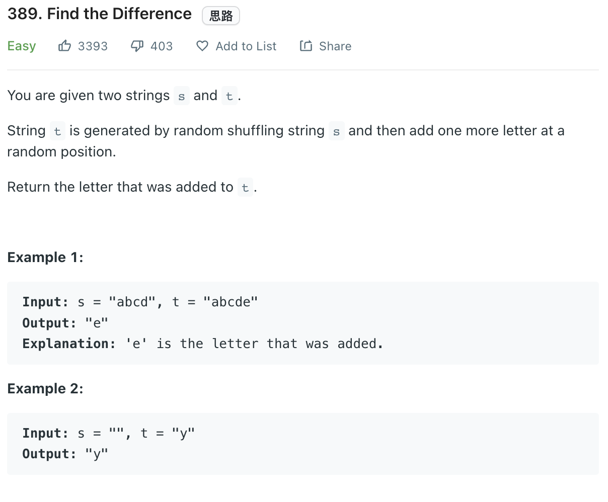

___
[389. Find the Difference](https://leetcode.com/problems/find-the-difference/)
___

## 分析问题
* 

## 基本思路
* 

___

`Time complexity : O(n)`

`Space complexity : O(n)`
```python
class Solution:
    def findTheDifference(self, s: str, t: str) -> str:
        sDic = collections.Counter(s)
        
        for char in t:
            if char not in sDic or sDic[char] == 0:
                return char
            sDic[char] -= 1
        
        
```