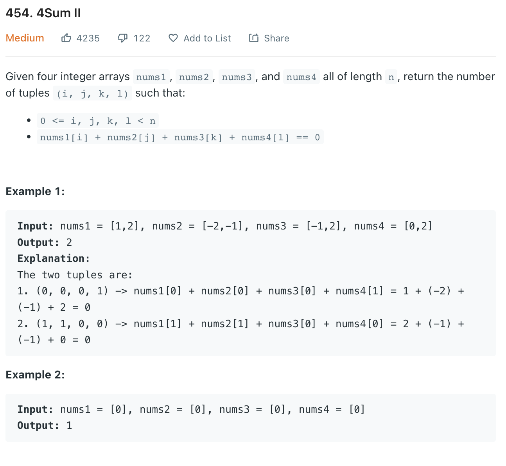

___
[454. 4Sum II](https://leetcode.com/problems/4sum-ii/)
___


## 基本思路
* Having a hashmap, the key is the sum, value is the counts of that sum.
* Split the input into 2 parts.
* First part we store the sum and its counts.
* Second round, we find is there any -sum 

___

`Time complexity : O(n^2)`

`Space complexity : O(n^2)`
```python
class Solution:
    def fourSumCount(self, nums1: List[int], nums2: List[int], nums3: List[int], nums4: List[int]) -> int:
        dic = collections.defaultdict(int)
        
        answer = 0
        for num1 in nums1:
            for num2 in nums2:
                dic[num1 + num2] += 1
                
        for num3 in nums3:
            for num4 in nums4:
                if -(num3 + num4) in dic:
                    answer += dic[-(num3 + num4)]
                    
        return answer
```

___


```python
class Solution:
    def fourSumCount(self, nums1: List[int], nums2: List[int], nums3: List[int], nums4: List[int]) -> int:
        
        def countSum(lists):
            result = Counter({0: 1})
            
            for l in lists:
                temp = Counter()
                for num in l:
                    for total in result:
                        temp[total + num] += result[total]
                    
                result = temp
            
            return result
        
        lsts = [nums1, nums2, nums3, nums4]
        k = len(lsts) // 2
        left, right = countSum(lsts[:k//2]), countSum(lsts[k//2:])
        
        return sum(left[s] * right[-s] for s in left)
        
```