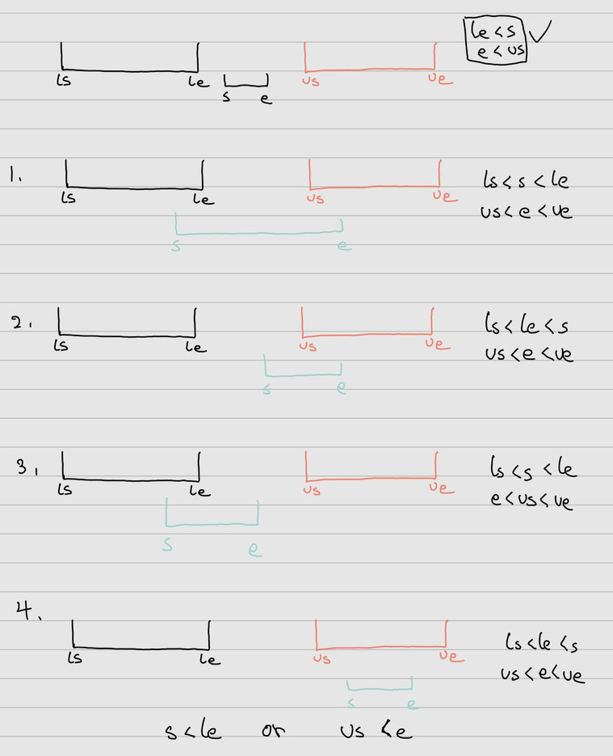

___
[729. My Calendar I](https://leetcode.com/problems/my-calendar-i/)
___


## 基本思路
* This is a logic question, you need to draw
* 

___

`Time complexity : O(nlog(n))`

`Space complexity : O(n)`
```java
class MyCalendar {
    
    TreeSet<int[]> books;

    public MyCalendar() {
        books = new TreeSet<int[]>((a, b) -> a[0] - b[0]);
    }
    
    public boolean book(int start, int end) {
        int[] book = {start, end};
        int[] lowerBound = books.floor(book);
        int[] upperBound = books.ceiling(book);
        if (lowerBound != null && start < lowerBound[1]) {
            return false;
        }
        if (upperBound != null && upperBound[0] < end) {
            return false;
        }
            
        books.add(book);
        return true;
    }
}
```