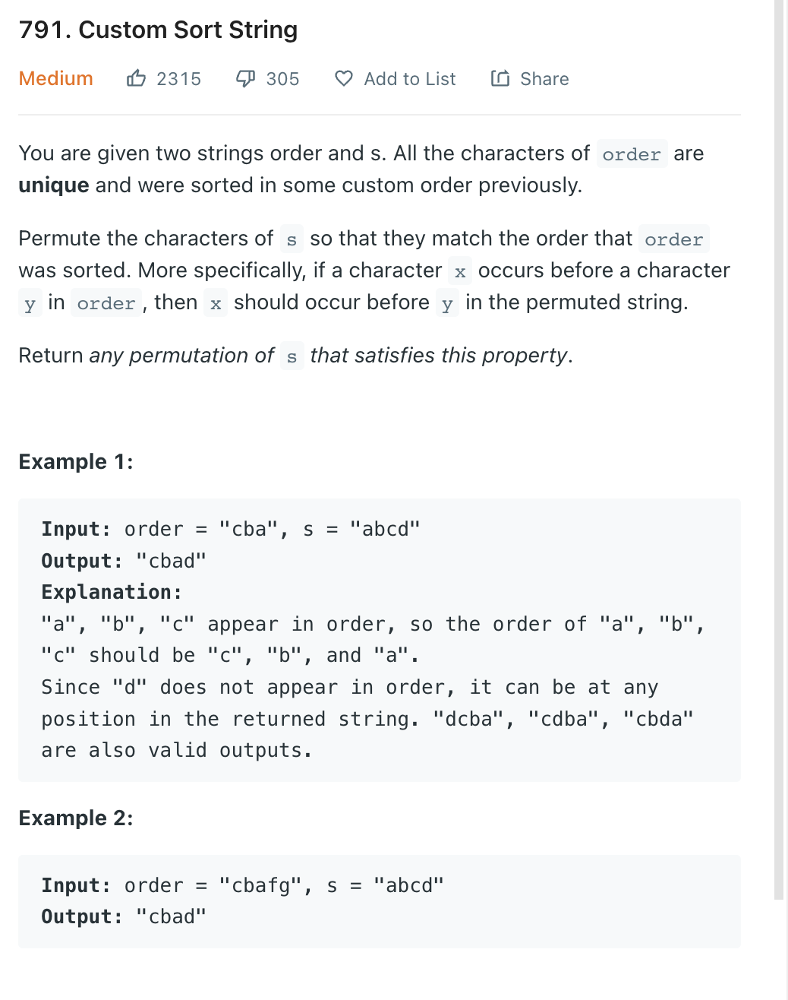

___
[791. Custom Sort String](https://leetcode.com/problems/custom-sort-string/)
___


## 基本思路
* This is a Greedy HashMap question.
* We count the frquency of each char in `s`
* Then loop the `order` and append the answer

___

`Time complexity : O(n)`

`Space complexity : O(n)`
```python
class Solution:
    def customSortString(self, order: str, s: str) -> str:
        frequency = collections.Counter(s)
        frequency = dict(sorted(frequency.items(), key=lambda x:x[1], reverse=True))
        
        answer = []
        for c in order:
            if c in frequency:
                answer.append(c * frequency[c])
                frequency[c] = 0
        
        for char, counts in frequency.items():
            if counts != 0:
                answer.append(char * counts)
        
        return ''.join(answer)

```

___

```python
class Solution:
    def customSortString(self, order: str, s: str) -> str:
        frequency = collections.Counter(s)
        
        answer = ""
        for c in order:
            if c in frequency:
                answer += c * frequency[c]
                frequency.pop(c)
        
        return answer + ''.join([char * frequency[char] for char in frequency])

```