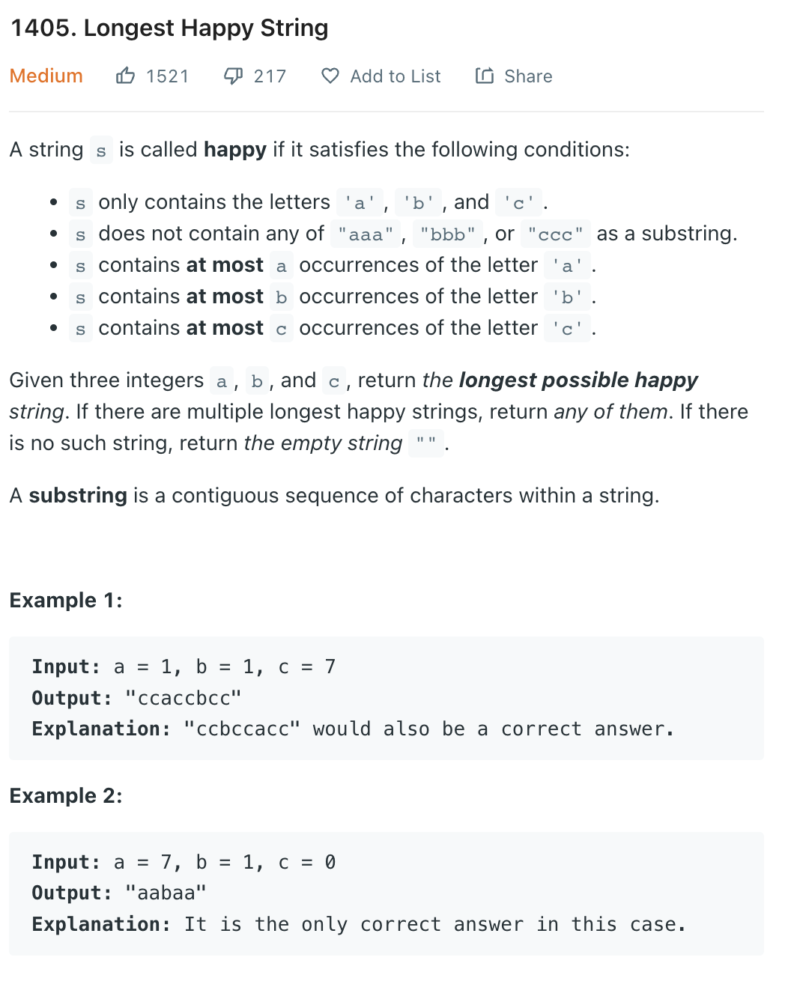

___
[1405. Longest Happy String](https://leetcode.com/problems/longest-happy-string/)
___


## 基本思路
* This is same as [767. Reorganize String](https://github.com/longlonglu/shuati/blob/main/heap/767.%20Reorganize%20String/767.%20Reorganize%20String.md).
* Have a maxHeap.
* If `answer[-2]` == `answer[-1]` == `char1`, we know this `char1` is not ok, get next char

___

`Time complexity : O(nlog(n))`

`Space complexity : O(n)`
```python
from heapq import heappush, heappop
from collections import namedtuple
class Solution:
    def longestDiverseString(self, a: int, b: int, c: int) -> str:
        Pair = namedtuple('Pair', ['char', 'counts'])
        Pair.__lt__ = lambda a, b: a.counts > b.counts
        heap = []
        
        if a != 0:
            heappush(heap, Pair('a', a))
            
        if b != 0:
            heappush(heap, Pair('b', b))
        
        if c != 0:
            heappush(heap, Pair('c', c))
        answer = []

                
        while heap:
            char1, count1 = heappop(heap)
            if len(answer) >= 2 and answer[-1] == answer[-2] == char1:
                if not heap:
                    return ''.join(answer)
                char2, count2 = heappop(heap)
                answer.append(char2)
                count2 -= 1
                if count2 != 0:
                    heappush(heap, Pair(char2, count2))
                heappush(heap, Pair(char1, count1))
                
            else:
                answer.append(char1)
                count1 -= 1
                if count1 != 0:
                    heappush(heap, Pair(char1, count1))
            
        return ''.join(answer)
        
```