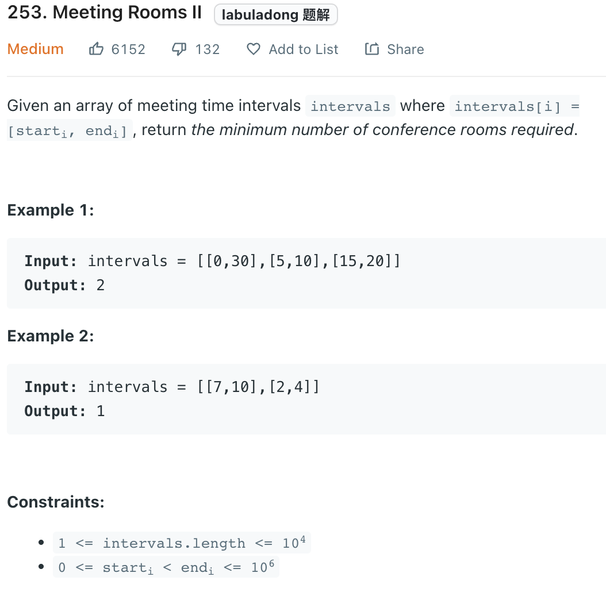

___
[253. Meeting Rooms II](https://leetcode.com/problems/meeting-rooms-ii/)
___


## 基本思路
* The determination of create extra room is depend on the samllest ending time

* This is an interval question.
* For most of any interval questions, sort first.
* Sort by starting time(ascending).
* Then create a PriorityQueue and sort by ending time(ascending).
* Since the PQ will always return us the smallest ending time.
* So we only need to check if the current starting time is > or < than the smallest ending time.
* If the current starting time is > than the smallest ending time, then those two intervals are not overlap, (no additional room required)
* If the current starting time is < than the smallest ending time, then those two intervals overlap, (need additional room.)
* Sort by staring time, we want to make sure all small starting time meeting get pushed into the queue ealy.
* Queue sort by ending time, We know the shorest endting time, or in another word, the easliest room we can use.


___

`Time complexity : O(NlogN)`

`Space complexity : O(N)`
```python
from heapq import heappush, heappop
class Solution:
    def minMeetingRooms(self, intervals: List[List[int]]) -> int:
        
        if not intervals:
            return 0
        
        intervals.sort(key= lambda x: x[0])
    
        heap = []
        
        for i in range(0, len(intervals)):
            current_start, current_end = intervals[i]
            heappush(heap, current_end)
            previous_end = heap[0]

            if previous_end <= current_start:
                heappop(heap)
            
        return len(heap)
```

___

```java
class Solution {
    public int minMeetingRooms(int[][] intervals) {
        Arrays.sort(intervals, (i1, i2) -> i1[0] - i2[0]);    
        PriorityQueue<int[]> heap = new PriorityQueue<>((i1, i2) -> i1[1] - i2[1]);
        for (int[] meeting: intervals) {
            heap.offer(meeting);
            if (heap.peek()[1] <= meeting[0]) { heap.poll(); }    
        }
        return heap.size();
    }
}
```