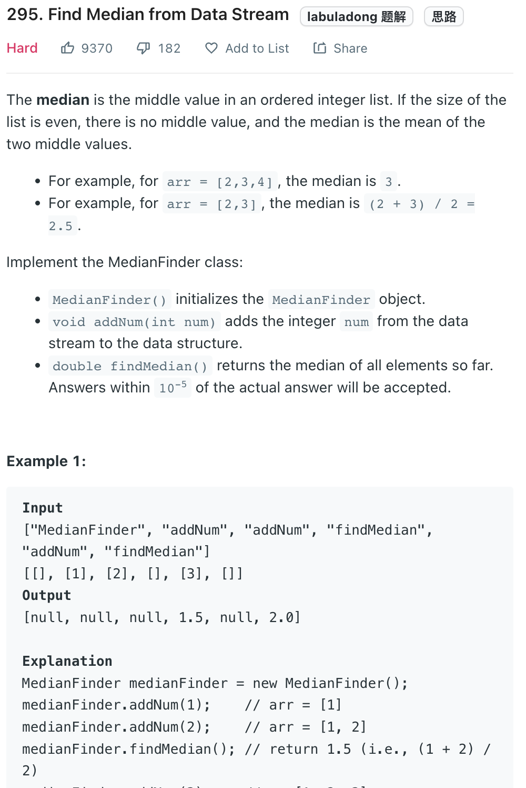

___
[295. Find Median from Data Stream](https://leetcode.com/problems/find-median-from-data-stream/)
___


## 基本思路
* We can have two PriorityQueue.
* One `maxHeap`(pop will return the max element) and one `minHeap` (pop will return the min element)
* The job is maintain the size of them balance.
* If a `num` is less than `maxElement` in `maxHeap`, we insert into `maxHeap`
* And then rebalance the size
* Make sure the smallest in `minQ` need to >= than max in `maxQ`

___

`Time complexity : O(log(n))`

`Space complexity : O(n)`
```java
class MedianFinder {
    
    private PriorityQueue<Integer> maxQ;
    private PriorityQueue<Integer> minQ;

    public MedianFinder() {
        maxQ = new PriorityQueue<>((a, b) -> b - a);
        minQ = new PriorityQueue<>();
    }
    
    public void addNum(int num) {
        if (maxQ.size() == 0 && minQ.size() == 0) { maxQ.add(num); }
        else if (num < maxQ.peek()) {
            maxQ.add(num);
        } else {
            minQ.add(num);
        }
        
        while (Math.abs(maxQ.size() - minQ.size()) > 1) {
            if (maxQ.size() < minQ.size()) { maxQ.add(minQ.remove()); }
            else { minQ.add(maxQ.remove()); }
        }
    }
    
    public double findMedian() {
        if (maxQ.size() == minQ.size()) {
            return (maxQ.peek() + minQ.peek()) / 2.0;
        } else if (maxQ.size() > minQ.size()){
            return maxQ.peek();
        } else {
            return minQ.peek();
        }
    }
}
```