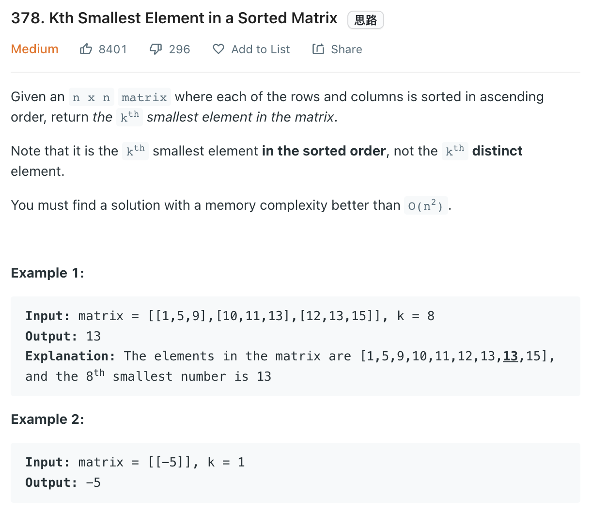

___
[378. Kth Smallest Element in a Sorted Matrix](https://leetcode.com/problems/kth-smallest-element-in-a-sorted-matrix/)
___

## 基本思路
* Since there might contains duplicate number, so the normal line by line search will not work.
* The easy way of doing this question is using PriorityQueue.
* Each element in `minQ` contains 3 factors, `[numValue, rowIndex, colIndex]`
* In this way, we can easily keep track of next smaller element.

___

`Time complexity : O(nlog(k))`

`Space complexity : O(k)`
```python
from heapq import heappush, heappop
class Solution:
    def kthSmallest(self, matrix: List[List[int]], k: int) -> int:
        minQ = []
        rowLength, colLength = len(matrix), len(matrix[0])
        
        for i in range(rowLength):
            heappush(minQ, (matrix[i][0], i, 0))
        
        while minQ and k > 1:
            num, row, col = heappop(minQ)
            k -= 1
            if col + 1< colLength:
                heappush(minQ, (matrix[row][col + 1], row, col + 1))
        
        return heappop(minQ)[0]
        
```