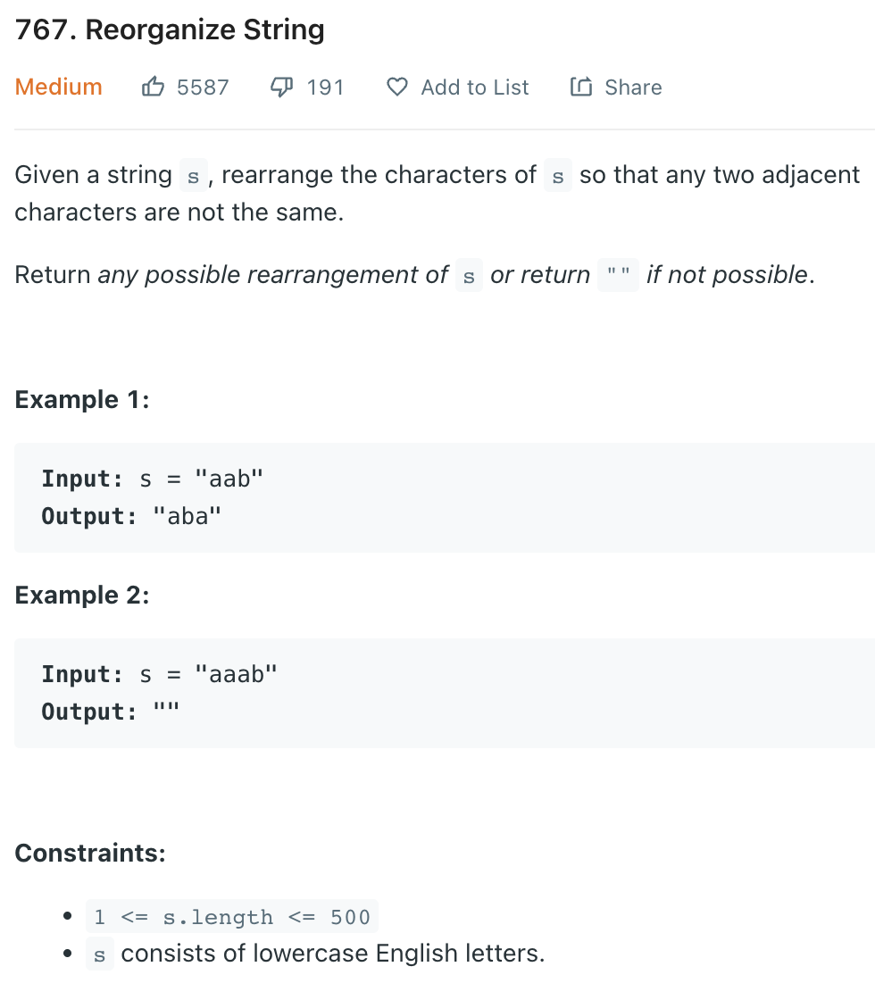

___
[767. Reorganize String](https://leetcode.com/problems/reorganize-string/)
___


## 基本思路
* This question is kind of like greedy
* We count the frequency of each Character first.
* Then we choose next Character based on their frequency.
* If current Character is equal to previous Character, then we retrive another Character from the queue.

___

`Time complexity : O()`

`Space complexity : O()`
```java
class Solution {
    public String reorganizeString(String s) {
        StringBuilder answer = new StringBuilder();
        int length = s.length();
        Map<Character, Integer> map = new HashMap<>();
        
        for (char c: s.toCharArray()) {
            map.put(c, map.getOrDefault(c, 0) + 1);
            if (map.get(c) > (length + 1) / 2) {
                return "";
            }
        }
        
        PriorityQueue<int[]> queue = new PriorityQueue<>((a, b) -> b[1] - a[1]);
        
        for (char c: map.keySet()) {
            queue.offer(new int[] {c, map.get(c)});
        }
        
        while (!queue.isEmpty()) {
            int[] first = queue.poll();
            if (answer.length() == 0 || answer.charAt(answer.length() - 1) != first[0]) {
                answer.append((char) first[0]);
                if (--first[1] > 0) {
                    queue.offer(first);
                }
            } else {
                int[] second = queue.poll();
                answer.append((char) second[0]);
                if (--second[1] > 0) {
                    queue.offer(second);
                }
                queue.offer(first);
            }
        }
        
        
        return answer.toString();
    }
}
```