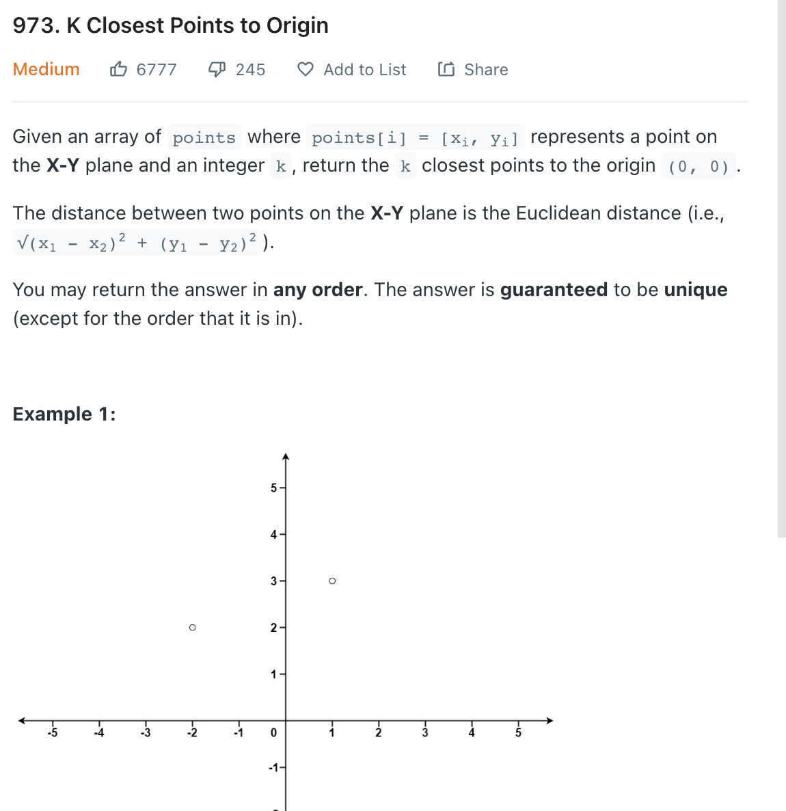

___

[973. K Closest Points to Origin](https://leetcode.com/problems/k-closest-points-to-origin/)
___

## 基本思路
* Having a max heap, each time it's going pop the max value in queue.
* Since we want K smallest elements, we use a K-size max heap. We repeatedly add elements to the heap. When the size is greater than K, we remove the largest element.

___

`Time complexity : O(nlog(k))`

`Space complexity : O(k)`
```java
class Solution {
    public int[][] kClosest(int[][] points, int k) {
        PriorityQueue<int[]> pq = new PriorityQueue<int[]>((p1, p2) -> p2[0] * p2[0] + p2[1] * p2[1] - p1[0] * p1[0] - p1[1] * p1[1]);

        for (int[] point: points) {
            pq.add(point);
            if (pq.size() > k) {
                pq.remove();
            }
        }
        int[][] answer = new int[k][2];
        int i = 0;
        while (!pq.isEmpty()) {
            answer[i++] = pq.remove();
        }
        return answer;
    }
}
```