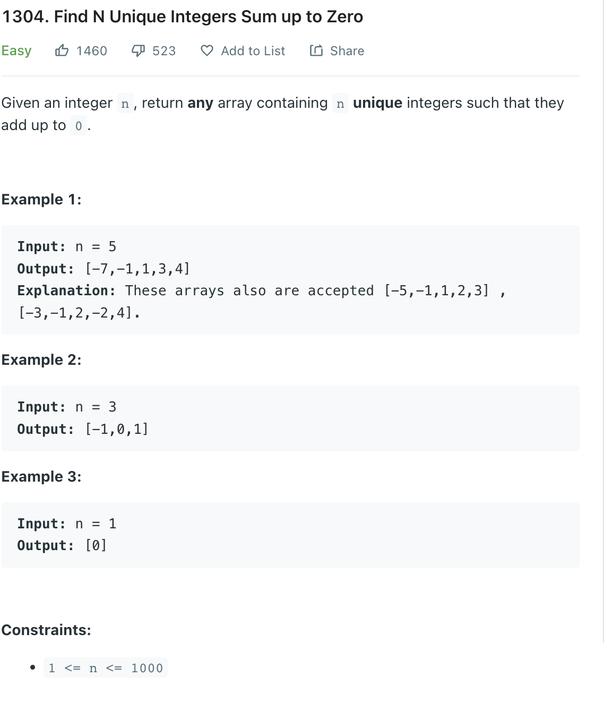

___
[1304. Find N Unique Integers Sum up to Zero](https://leetcode.com/problems/find-n-unique-integers-sum-up-to-zero/)
___

## 基本思路
* If input is 5 return [-2, -1, 0, 1, 2]
* If input is 4 return [-2, -1, 1, 2]

___

`Time complexity : O(n)`

`Space complexity : O(1)`
```python
class Solution:
    def sumZero(self, n: int) -> List[int]:
        answer = []
        mid = n // 2
        
        for i in range(-mid, mid + 1, 1):
            if i == 0:
                continue
            answer.append(i)
        
        if n % 2 != 0:
            answer.append(0)
        return answer
```