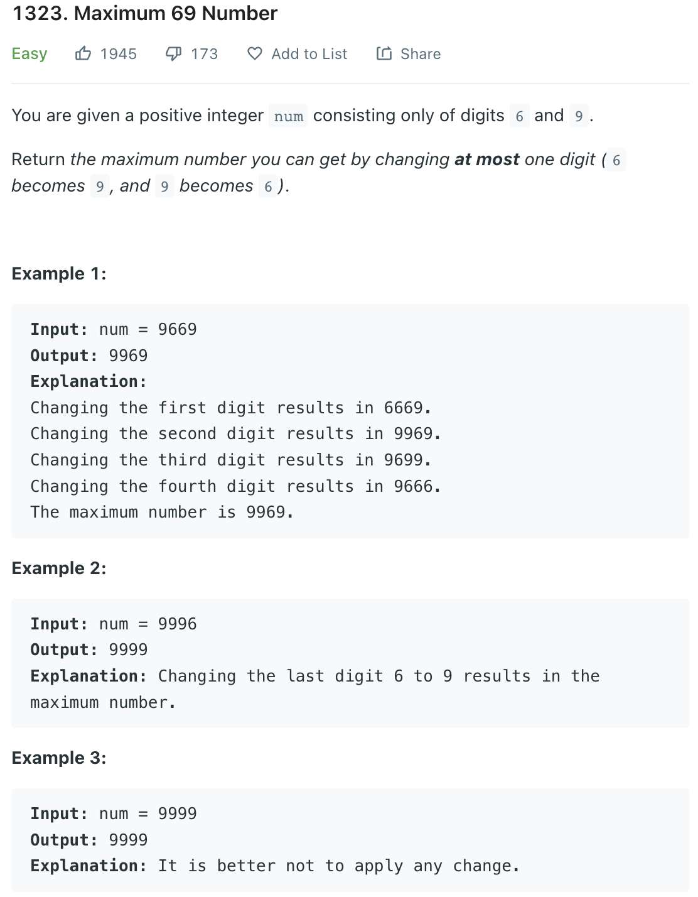
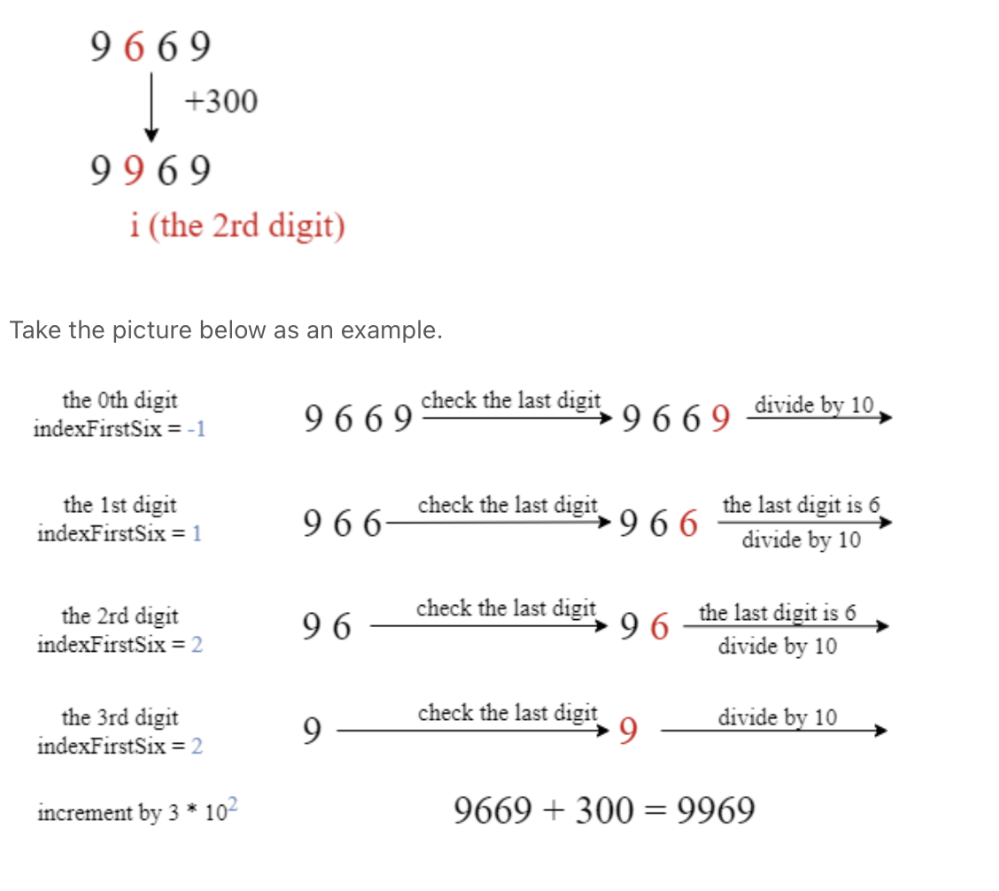

___
[1323. Maximum 69 Number](https://leetcode.com/problems/maximum-69-number/)
___


## 基本思路
* Convert to String and replace the first '6' to '9'. It's easy but slow
* Another way is using math way
* If we can find the index of `first_six_digit` and then `num + 3 * 10 ^ first_six_digit`
* It's also changing the 6 to 9



___

`Time complexity : O(len(num))`

`Space complexity : O(len(num))`
```python
class Solution:
    def maximum69Number (self, num: int) -> int:
        
        s = str(num)
        for i in range(len(s)):
            if s[i] == '6':
                return int(s.replace('6', '9', 1))
            
        return num
```


___

```python
class Solution:
    def maximum69Number (self, num: int) -> int:
        
        current_digit = 0
        num_copy = num
        first_six_index = -1
        
        while num > 0:
            if num % 10 == 6:
                first_six_index = current_digit
            
            num //= 10
            current_digit += 1
            
        return num_copy if first_six_index == -1 else num_copy + 3 * 10**first_six_index
```