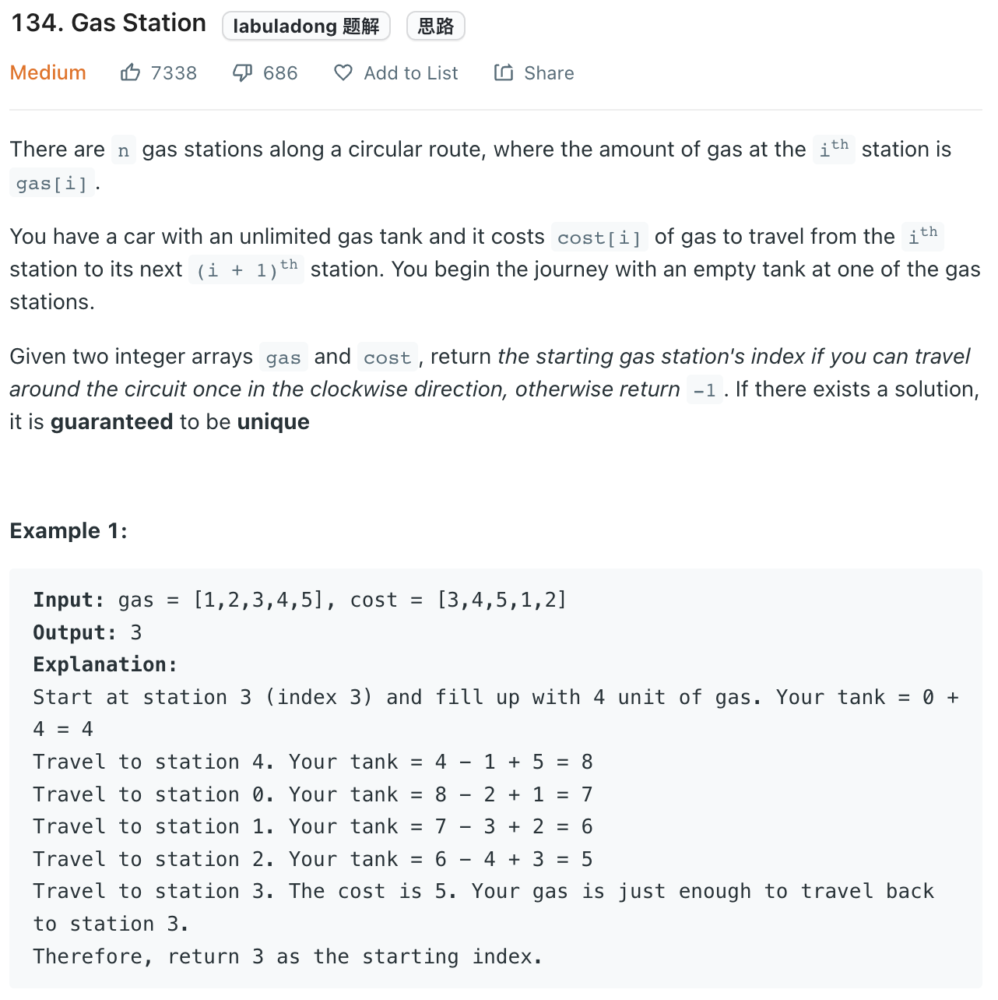

___
[134. Gas Station](https://leetcode.com/problems/gas-station/)
___

## 基本思路
* In order to know we can finish the trip or not, we sum all gas and cost together.
* If `totalTank` is less than 0, which means we are not able to finish the trip.
* The key point is how do we find a `startingStation`
* If we can finish the whole trip, that means there must exist one solution.
* And that solution will be at the right most
___

`Time complexity : O(n)`

`Space complexity : O(1)`
```python
class Solution:
    def canCompleteCircuit(self, gas: List[int], cost: List[int]) -> int:
        totalTank = currentTank = 0
        
        startingStation = 0
        
        for i in range(len(gas)):
            totalTank += gas[i] - cost[i]
            currentTank += gas[i] - cost[i]
            
            if currentTank < 0:
                startingStation = i + 1
                currentTank = 0
        
        return startingStation if totalTank >= 0 else -1
```