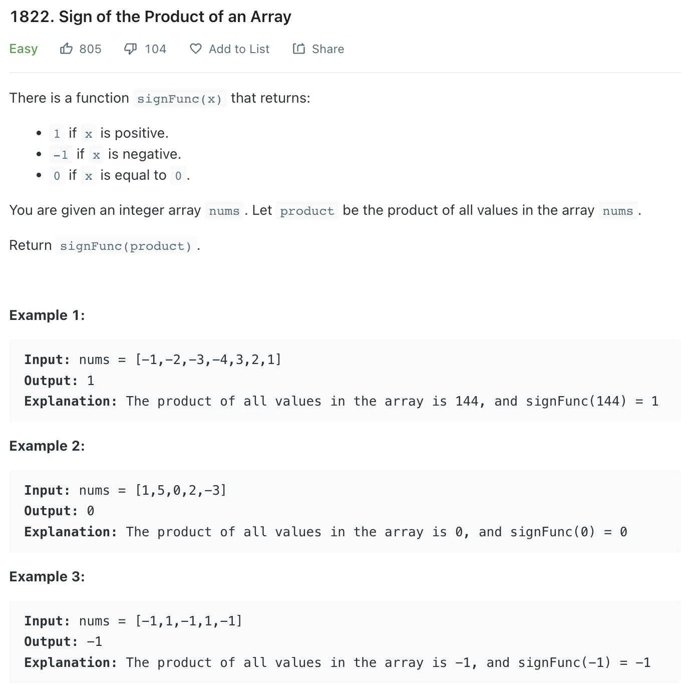

___
[1822. Sign of the Product of an Array](https://leetcode.com/problems/sign-of-the-product-of-an-array/)
___

## 基本思路
* 

___

`Time complexity : O(n)`

`Space complexity : O(1)`
```python
class Solution:
    def arraySign(self, nums: List[int]) -> int:
        
        sign = 1
        
        for num in nums:
            if num == 0:
                return 0
            if num < 0:
                sign = -sign
        
        return sign
```