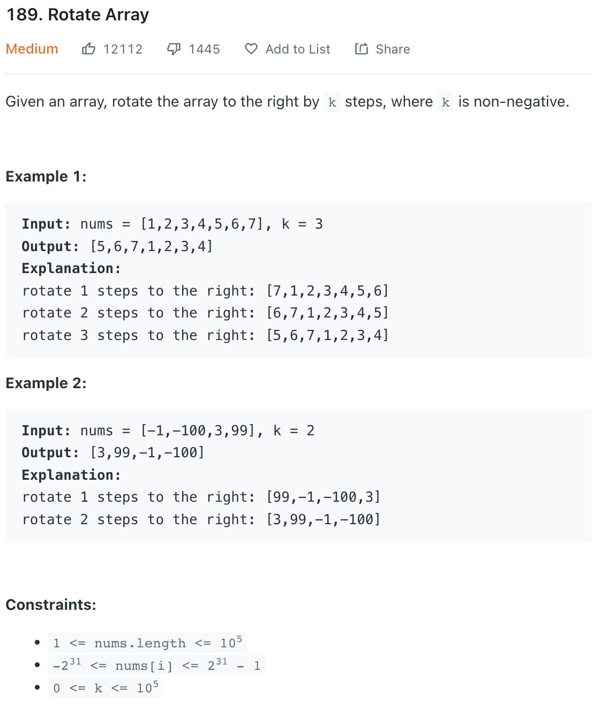
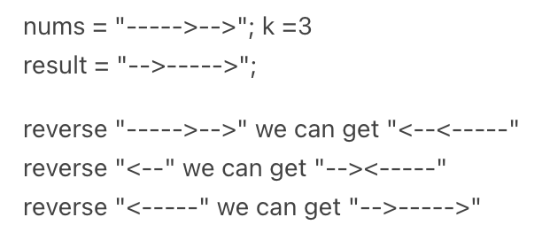
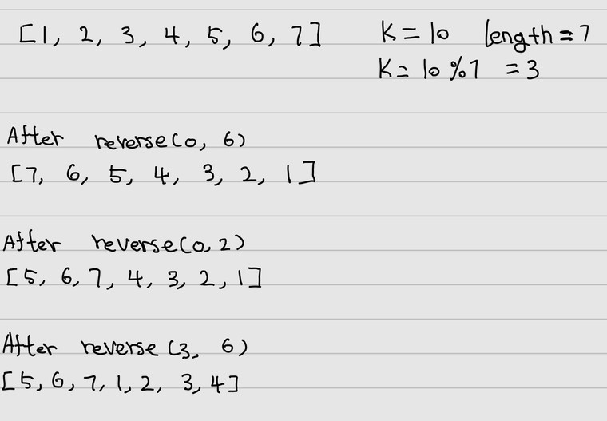

___
[189. Rotate Array](https://leetcode.com/problems/rotate-array/)
___


## 基本思路
* This is a math problem called reversal algorithem.
* You are not able to figure it out.




___

`Time complexity : O(n)`

`Space complexity : O(1)`
```python
class Solution:
    def rotate(self, nums: List[int], k: int) -> None:
        """
        Do not return anything, modify nums in-place instead.
        """
        def reverse(start, end):
            while start <= end:
                nums[start], nums[end] = nums[end], nums[start]
                start += 1
                end -= 1
        
        length = len(nums)
        
        k = k % length
        
        reverse(0, length - 1)
        reverse(0, k - 1)
        reverse(k, length - 1)
```