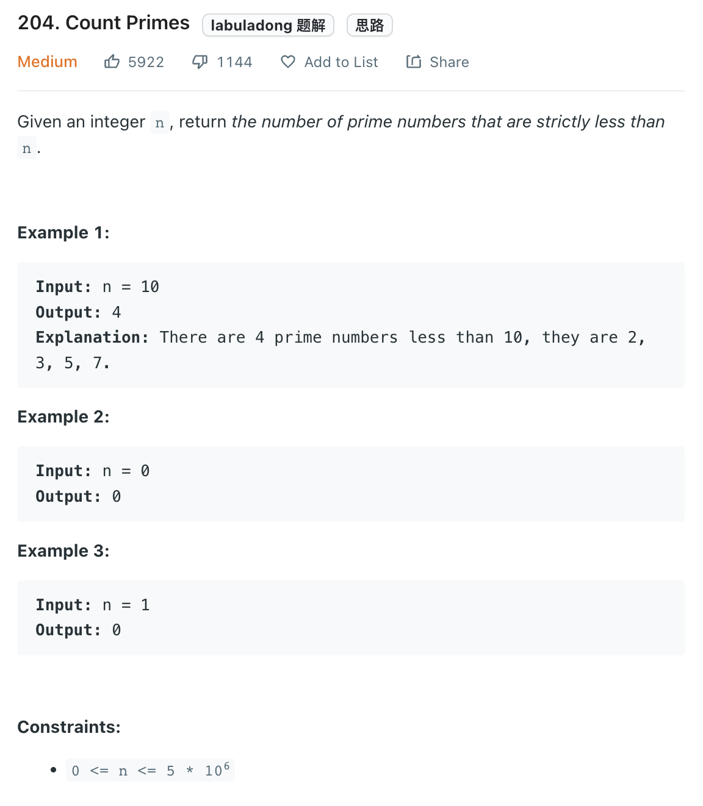

___
[204. Count Primes](https://leetcode.com/problems/count-primes/)
___


___

`Time complexity : O()`

`Space complexity : O(n)`
```python
class Solution:
    def countPrimes(self, n: int) -> int:
        isPrime = [True for _ in range(n)]
        
        for i in range(2, int(sqrt(n)) + 1):
            if isPrime[i]:
                for multiple in range(i * i, n, i):
                    isPrime[multiple] = False
                    
        answer = 0
        
        for i in range(2, n):
            if isPrime[i]:
                answer += 1
            
        return answer
```