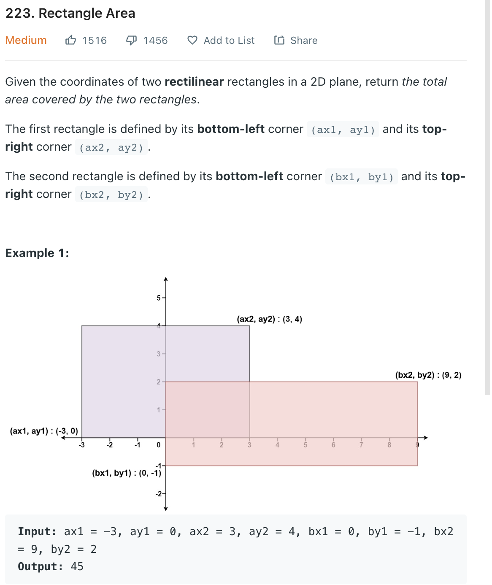
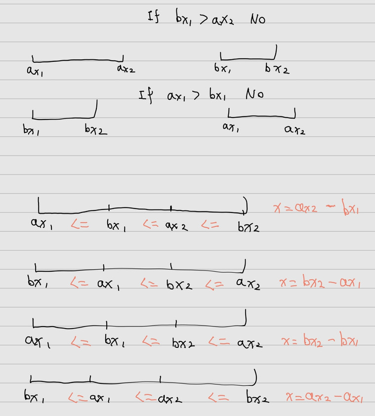

___
[223. Rectangle Area](https://leetcode.com/problems/rectangle-area/)
___


## 基本思路
* This is math problem, draw all cases before you write the code

___

`Time complexity : O(1)`

`Space complexity : O(1)`
```python
class Solution:
    def computeArea(self, ax1: int, ay1: int, ax2: int, ay2: int, bx1: int, by1: int, bx2: int, by2: int) -> int:
        areaA = (ay2 - ay1) * (ax2 - ax1)
        areaB = (by2 - by1) * (bx2 - bx1)
        
        xOverlap = 0
        yOverlap = 0
            
        if ax1 <= bx1 <= ax2 <= bx2:
            xOverlap = ax2 - bx1
            
        if bx1 <= ax1 <= bx2 <= ax2:
            xOverlap = bx2 - ax1
        
        if ax1 <= bx1 <= bx2 <= ax2:
            xOverlap = bx2 - bx1
            
        if bx1 <= ax1 <= ax2 <= bx2:
            xOverlap = ax2 - ax1
            
        #-----------------
         
        if ay1 <= by1 <= ay2 <= by2:
            yOverlap = ay2 - by1
            
        if by1 <= ay1 <= by2 <= ay2:
            yOverlap = by2 - ay1
        
        if ay1 <= by1 <= by2 <= ay2:
            yOverlap = by2 - by1
            
        if by1 <= ay1 <= ay2 <= by2:
            yOverlap = ay2 - ay1
        
        overlap = xOverlap * yOverlap
        return areaA + areaB - overlap 
```