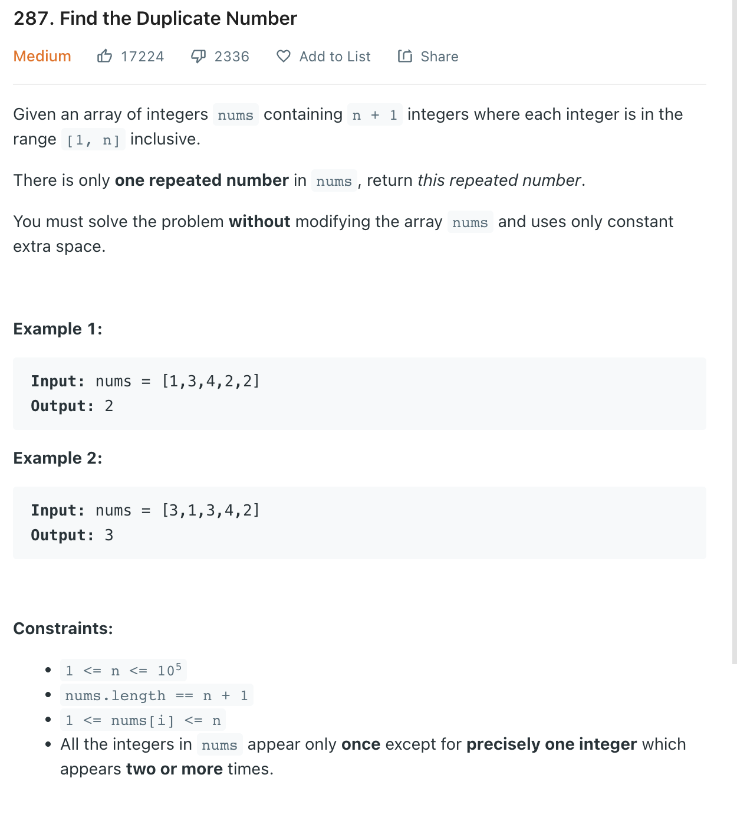

___
[287. Find the Duplicate Number](https://leetcode.com/problems/find-the-duplicate-number/)
___

## 分析问题
* 

## 基本思路
* 

___

`Time complexity : O(n)`

`Space complexity : O(1)`
```python
class Solution:
    def findDuplicate(self, nums: List[int]) -> int:
        for num in nums:
            cur = abs(num)
            if nums[cur] < 0:
                duplicate = cur
                break
            nums[cur] = -nums[cur]

        # Restore numbers
        for i in range(len(nums)):
            nums[i] = abs(nums[i])

        return duplicate
```