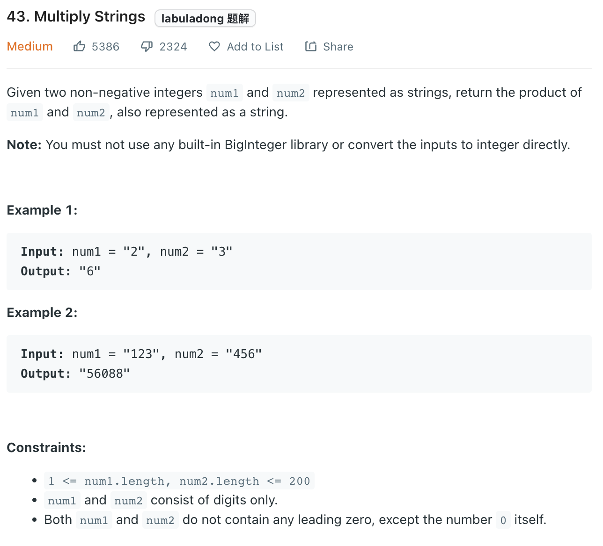

___
[43. Multiply Strings](https://leetcode.com/problems/multiply-strings/)
___

## 基本思路
* Convert 传统的乘法 to array

___

`Time complexity : O(M + N)`

`Space complexity : O(M + N)`
```python
class Solution:
    def multiply(self, num1: str, num2: str) -> str:
        num1 = num1.zfill(len(num2))
        num2 = num2.zfill(len(num1))
        answer = [0] * (len(num1) + len(num2))
 
        carry = 0
        
        for i in range(len(num1) - 1, -1, -1):
            for j in range(len(num2) - 1, -1, -1):
                sum = int(num1[i]) * int(num2[j]) + carry + answer[i + j + 1]
                carry = sum // 10
                sum = sum % 10
                answer[i + j + 1] = sum
            if carry != 0:
                answer[i] = carry
                carry = 0
        index = 0
        while index < len(answer) and answer[index] == 0:
            index += 1
        
        answer = answer[index:]
        if len(answer) == 0:
            return "0"
        return ''.join(str(num) for num in answer)
```