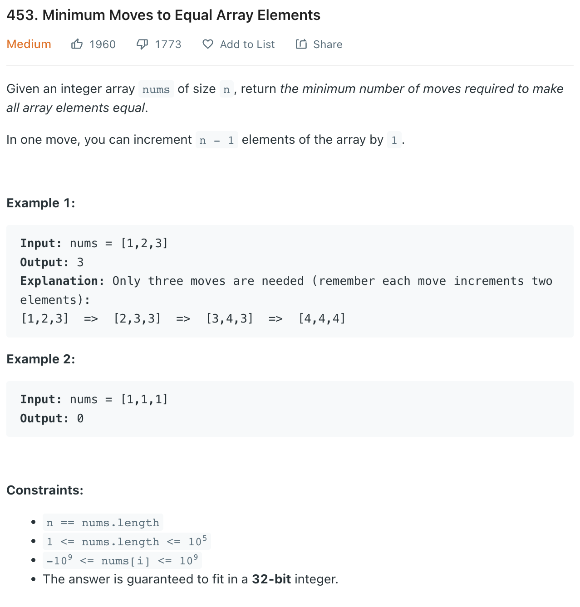

___
[453. Minimum Moves to Equal Array Elements](https://leetcode.com/problems/minimum-moves-to-equal-array-elements/)
___


## 基本思路
* The Math way needs lucky
* Burte Force way TLE
* For Burte Force way
* We find the max element and min element in each loop
* If they are equal, return
* Else, make element except max element + 1

___

`Time complexity : O(n)`

`Space complexity : O(1)`
```python
class Solution:
    def minMoves(self, nums: List[int]) -> int:
        minNum = min(nums)
        answer = 0
        for num in nums:
            answer += num - minNum
        
        return answer
```

___

```java
public class Solution {
    public int minMoves(int[] nums) {
        int min = 0, max = nums.length - 1, count = 0;
        while (true) {
            for (int i = 0; i < nums.length; i++) {
                if (nums[max] < nums[i]) {
                    max = i;
                }
                if (nums[min] > nums[i]) {
                    min = i;
                }
            }
            if (nums[max] == nums[min]) {
                break;
            }
            for (int i = 0; i < nums.length; i++) {
                if (i != max) {
                    nums[i]++;
                }
            }
            count++;
        }
        return count;
    }
}
```