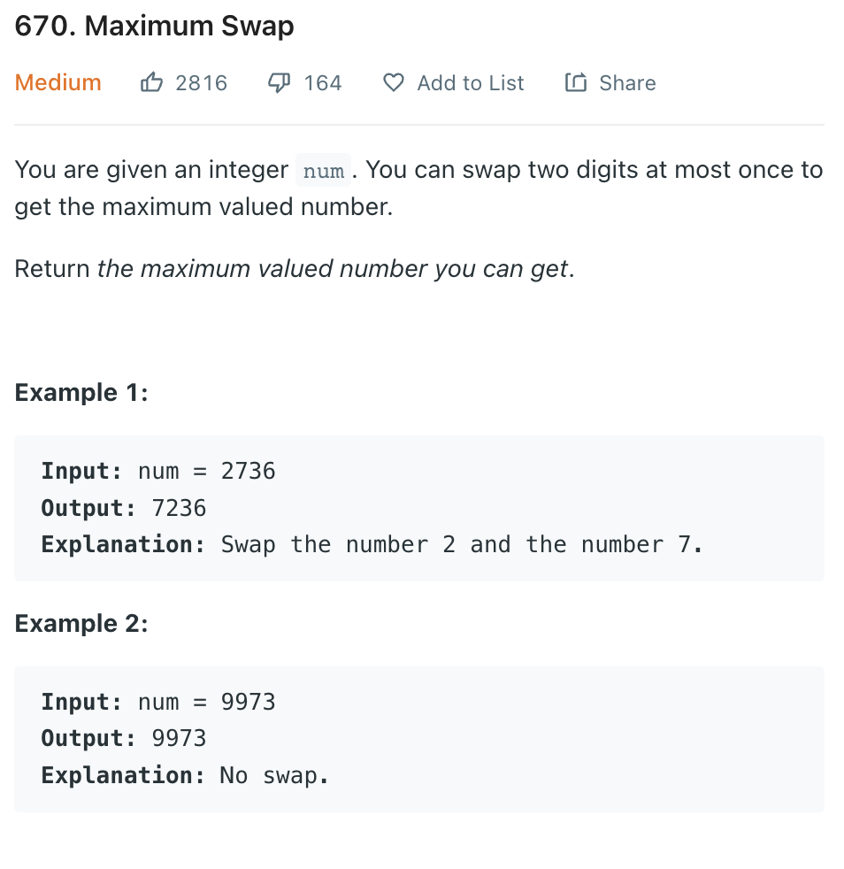

___
[670. Maximum Swap](https://leetcode.com/problems/maximum-swap/)
___


## 基本思路
* I'm using the brute force way to solve this problem.
* Which swap every possible digit and compare to `maxValue`

* There is another way of solving.
* It take only O(n) Time
* Backwards, find the max, if the current value less than max, it will be our candidate. If the current value bigger than max, we update max. If the current val equals to max, do nothing, because switch a number to the last occurance of max will maximize the results, since that number is less than max. If later another number less than max, we update our candidate, because switch at the front will give bigger result. Done!

___

`Time complexity : O(n^2)`

`Space complexity : O(n)`
```python
class Solution:
    def maximumSwap(self, num: int) -> int:
        maxValue = num
        
        nums = [int(x) for x in str(num)]
        
        for i in range(len(nums)):
            for j in range(i, len(nums)):
                nums[i], nums[j] = nums[j], nums[i]
                currentValue = 0
                for x in nums:
                    currentValue = currentValue * 10 + x
                maxValue = max(maxValue, currentValue)
                nums[i], nums[j] = nums[j], nums[i]
        
        return maxValue
```

___


```python
class Solution:
    def maximumSwap(self, num: int) -> int:  
        nums = [int(x) for x in str(num)]
        maxValueIndex = len(nums) - 1
        x = y = 0

        for i in range(len(nums) - 1, -1, -1):
            if nums[i] > nums[maxValueIndex]:
                maxValueIndex = i
            elif nums[i] < nums[maxValueIndex]:
                x = i
                y = maxValueIndex

        nums[x], nums[y] = nums[y], nums[x]
        
        return int(''.join(str(i) for i in nums))
```