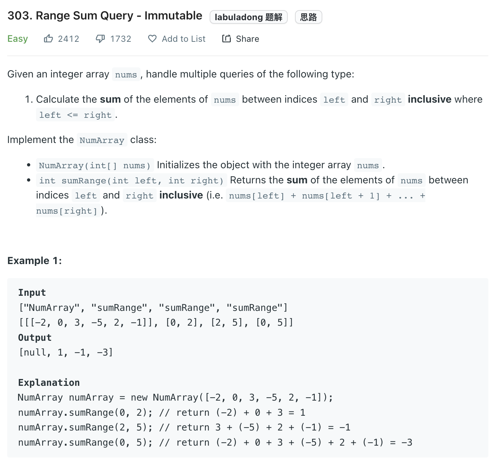

```python
class NumArray:

    def __init__(self, nums: List[int]):
        self.pre_sum = [0] * len(nums)
        self.pre_sum[0] = nums[0]

        for i in range(1, len(nums)):
            self.pre_sum[i] = self.pre_sum[i - 1] + nums[i]
          
    def sumRange(self, left: int, right: int) -> int:
        return self.pre_sum[right] - (self.pre_sum[left - 1] if left > 0 else 0)
```

