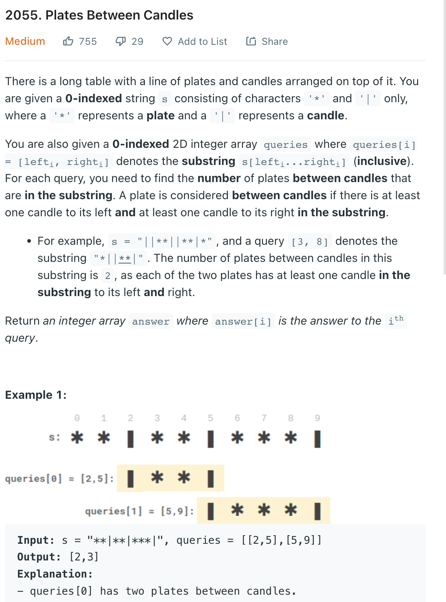

___
[2055. Plates Between Candles](https://leetcode.com/problems/plates-between-candles/)
___


## 基本思路
* Draw the `nearestRightCandle` `nearestLeftCandle` `candleUntilNow` first.
* For each index, find the `nearestRightCandle`, `nearestLeftCandle` and total candle from 0 until now `candleUntilNow` 
* For each query, find the `leftCandle` and `rightCandle` first.
* if both `leftCandle` and `rightCandle` are valid and their distance is also valid, we do next.
* Find the `totalDistance` between two candle
* Find the `totalCandles` between `totalDistance`
* Use `totalDistance` - `totalCandles` == total `plates` with those two candles
___

`Time complexity : O(len(s) + len(queries))`

`Space complexity : O(3len(s))`
```python
class Solution:
    def platesBetweenCandles(self, s: str, queries: List[List[int]]) -> List[int]:
        length = len(s)
        nearestRightCandle = [-1] * length
        nearestLeftCandle = [-1] * length
        candleUntilNow = [0] * length
        answer = []
        
        for i in range(length):
            if s[i] == '|':
                nearestLeftCandle[i] = i
            elif i > 0:
                nearestLeftCandle[i] = nearestLeftCandle[i - 1]
                
        
        for i in range(length - 1, -1, -1):
            if s[i] == '|':
                nearestRightCandle[i] = i
            elif i < length - 1:
                nearestRightCandle[i] = nearestRightCandle[i + 1]
        
        
        candle = 0
        for i in range(length):
            if s[i] == '|':
                candle += 1
            candleUntilNow[i] = candle
                
        for (left, right) in queries:
            leftCandle = nearestRightCandle[left]
            rightCandle = nearestLeftCandle[right]
            distance = rightCandle - leftCandle
            
            if leftCandle == -1 or rightCandle == -1 or distance <= 1:
                answer.append(0)
                continue
                
            totalDistance = rightCandle - leftCandle + 1
            candleWithinTotalDistance = candleUntilNow[rightCandle] - candleUntilNow[leftCandle] + 1
            plates = totalDistance - candleWithinTotalDistance
            answer.append(plates)
                
        return answer
            
        
#
#                        0  1  2  3  4  5  6  7  8  9  10  11  12  13  14  15  16  17  18  19  20
#
#                        *  *  *  |  *  *  |  *  *  *   *   *   |   *   *   |   |   *   *   |   * 
#nearest right candle:   3  3  3  3  6  6  6  12 12 12  12 12  12  15  15  15   16  19  19  19  -
#nearest left candle:    -  -  -  3  3  3  6  6  6  6   6  6   12  12  12  15  16  16  16   19  19
#candle count:           0  0  0  1  1  1  2  2  2  2   2  2    3   3   3   4   5   5   5   6   6  
#"***|**|*****|**||**|*"
```