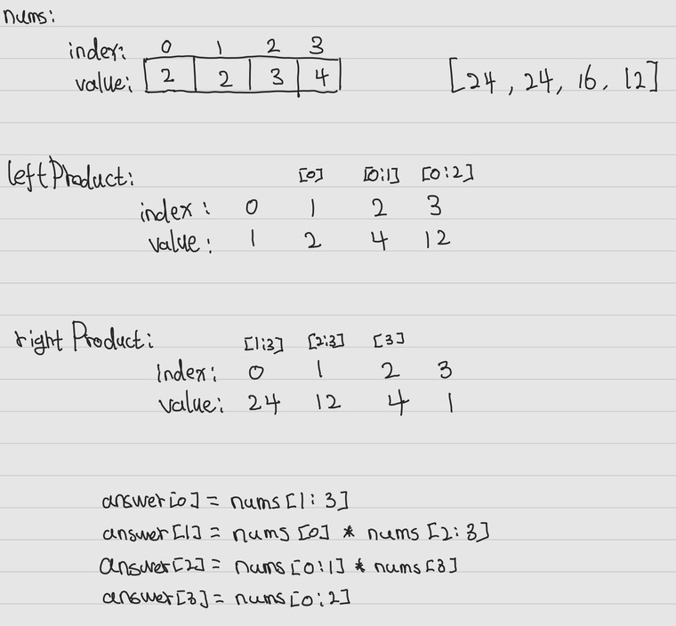

___
[238. Product of Array Except Self](https://leetcode.com/problems/product-of-array-except-self/)
___


## 基本思路
* Use Prefix_Sum


___

`Time complexity : O(n)`

`Space complexity : O(n or 1)`
```python
class Solution:
    def productExceptSelf(self, nums: List[int]) -> List[int]:
        length = len(nums)
        leftProduct = [1] * length
        rightProduct = [1] * length
        answer = []
        
        for i in range(1, length):
            leftProduct[i] = leftProduct[i - 1] * nums[i - 1]
        
        for i in range(length - 2, -1, -1):
            rightProduct[i] = rightProduct[i + 1] * nums[i + 1]
        
        for i in range(length):
            answer.append(leftProduct[i] * rightProduct[i])

        return answer
```

___

```python
class Solution:
    def productExceptSelf(self, nums: List[int]) -> List[int]:
        length = len(nums)
        leftProduct = [1] * length
        answer = []
        
        for i in range(1, length):
            leftProduct[i] = leftProduct[i - 1] * nums[i - 1]
        
        rightProduct = 1
        for i in range(length - 1, -1, -1):
            leftProduct[i] *= rightProduct
            rightProduct *= nums[i]

        return leftProduct
```