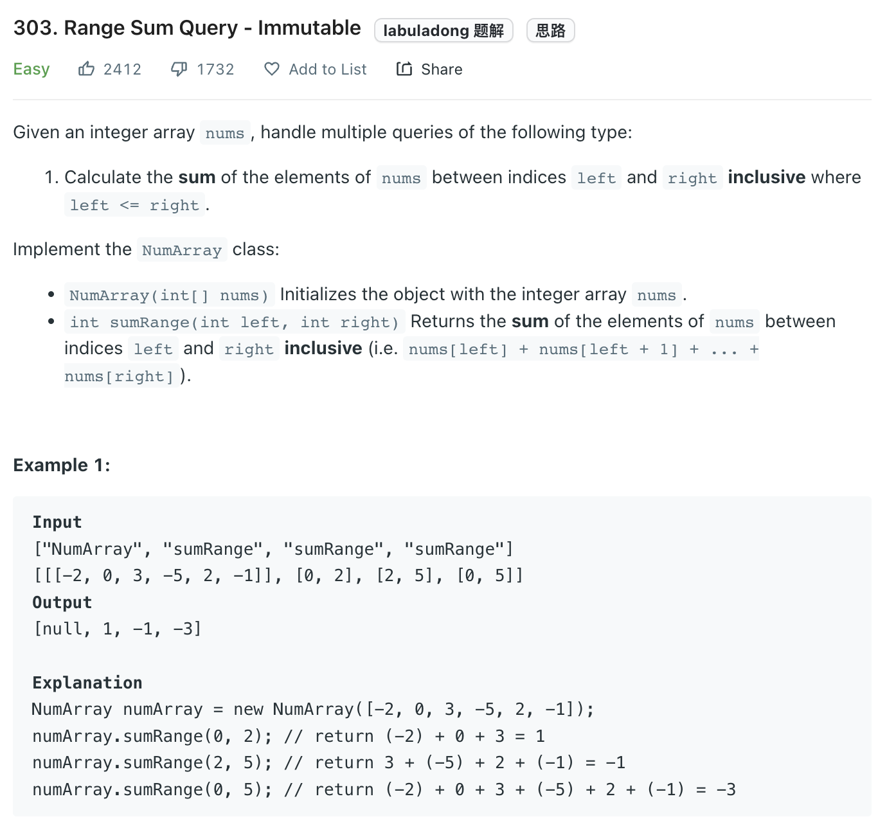
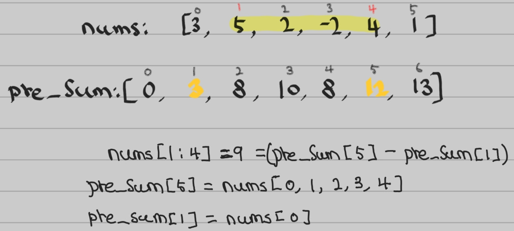

___

[303. Range Sum Query](https://leetcode.com/problems/range-sum-query-immutable/)

___

## 分析问题
* we can use the brute force way to solve this question, but we know we are going to call `sumRange` function multiple times. Instead of recalculate the solution each time, we can use prefix sum(dynamic programing) to optimize our solution. 

## 基本思路

* `pre_sum[i + 1]` equal to the sum summation of `nums[0:i]`
* base on this understanding, if we want to find the sum of `nums[1:4]`, just do `pre_sum[5] - pre_sum[1]` 
```python
class NumArray:

    def __init__(self, nums: List[int]):
        self.pre_sum = [0] * len(nums)
        self.pre_sum[0] = nums[0]

        for i in range(1, len(nums)):
            self.pre_sum[i] = self.pre_sum[i - 1] + nums[i]
          
    def sumRange(self, left: int, right: int) -> int:
        return self.pre_sum[right] - (self.pre_sum[left - 1] if left > 0 else 0)
```
___