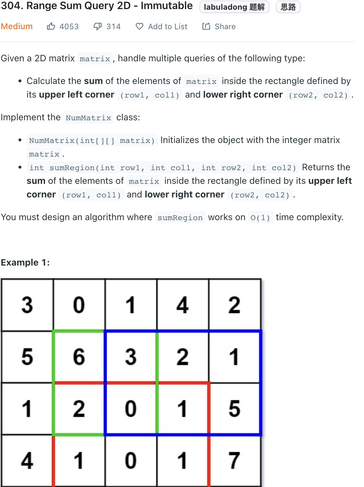
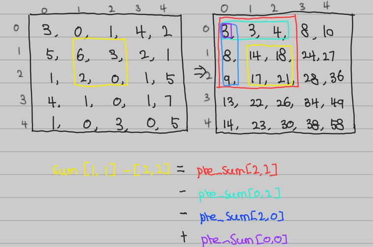

___
[304. Range Sum Query 2D](https://leetcode.com/problems/range-sum-query-2d-immutable/)
___

## 分析问题
* brute force is ok, since we are going to call `sumRegion` a lot, so it's better to optimize it.
  
## 基本思路

* Using `prefix sum` can save a lot of time in this question
* `pre_sum[i][j]` repersents the summation of `matrix` from `matrix[0][0]` to `matrix[i][j]` 
* My code is kinda messy, you can make the size of `pre_sum` to `pre_sum[len(matrix) + 1][len(matrix[0]) + 1]`

```python
class NumMatrix:
    
    def __init__(self, matrix: List[List[int]]):
        row_len, col_len = len(matrix), len(matrix[0])
        self.pre_sum = [ [0 for j in range(col_len)] for i in range(row_len) ]
        for i in range(row_len):
            for j in range(col_len):
                left = self.pre_sum[i][j - 1] if j > 0 else 0
                top = self.pre_sum[i - 1][j] if i > 0 else 0
                top_left = self.pre_sum[i - 1][j - 1] if i > 0 and j > 0 else 0
                self.pre_sum[i][j] = matrix[i][j] + top + left - top_left         
       
    def sumRegion(self, row1: int, col1: int, row2: int, col2: int) -> int:
        total_sum = self.pre_sum[row2][col2]
        top_sum = self.pre_sum[row1 - 1][col2] if row1 > 0 else 0
        left_sum = self.pre_sum[row2][col1 - 1] if col1 > 0 else 0
        top_left_sum = self.pre_sum[row1 - 1][col1 - 1] if row1 > 0 and col1 > 0 else 0
        return total_sum - top_sum - left_sum + top_left_sum
```