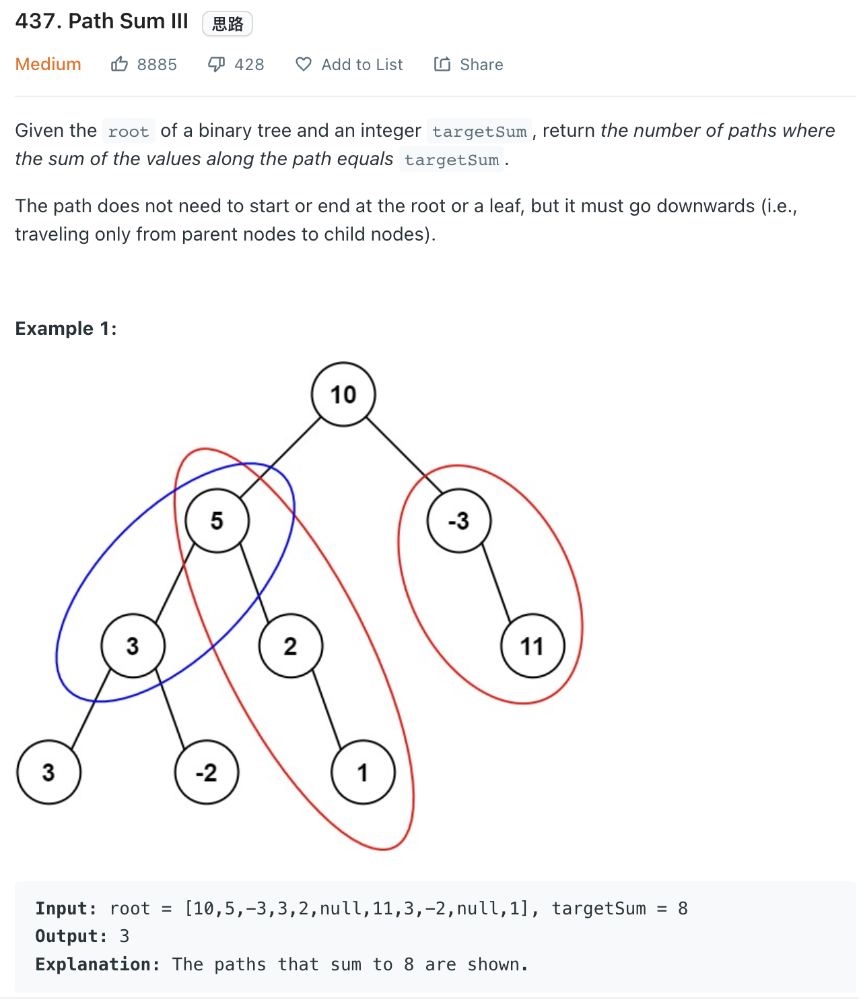
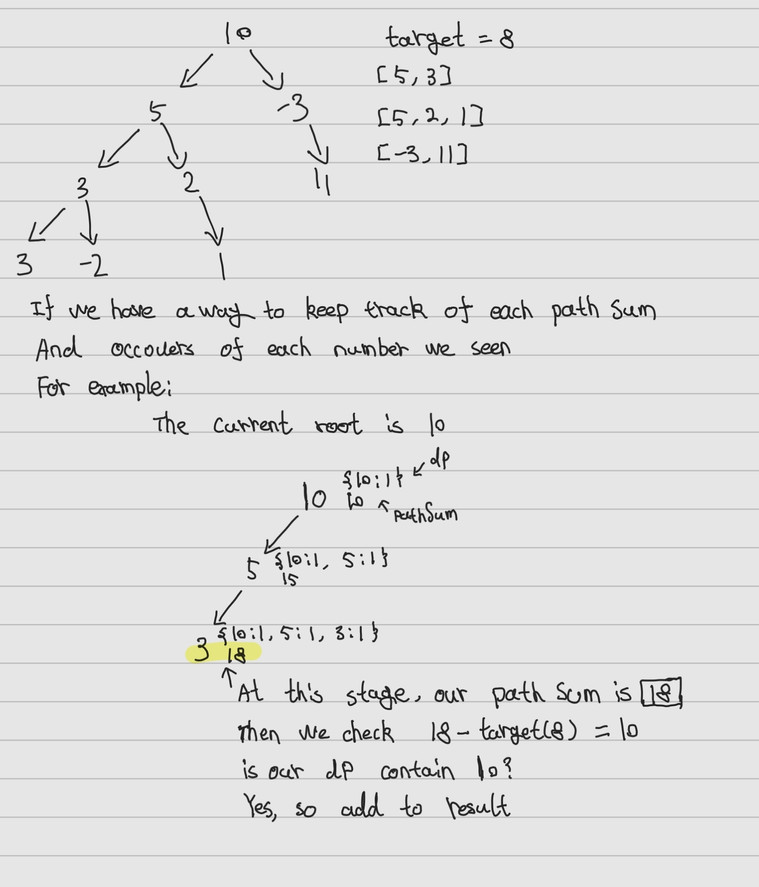

___
[437. Path Sum III](https://leetcode.com/problems/path-sum-iii/)
___


## 基本思路


___

`Time complexity : O(n^2)`

`Space complexity : O(1)`
```python
class Solution:
    def pathSum(self, root: Optional[TreeNode], targetSum: int) -> int:
        if not root:
            return 0
        
        numOfPath = self.dfs(root, targetSum)
        
        return numOfPath + self.pathSum(root.left, targetSum) + self.pathSum(root.right, targetSum)
    
    def dfs(self, root, target):
        if not root:
            return 0
        return int(target == root.val) + self.dfs(root.left, target - root.val) + self.dfs(root.right, target - root.val)
```