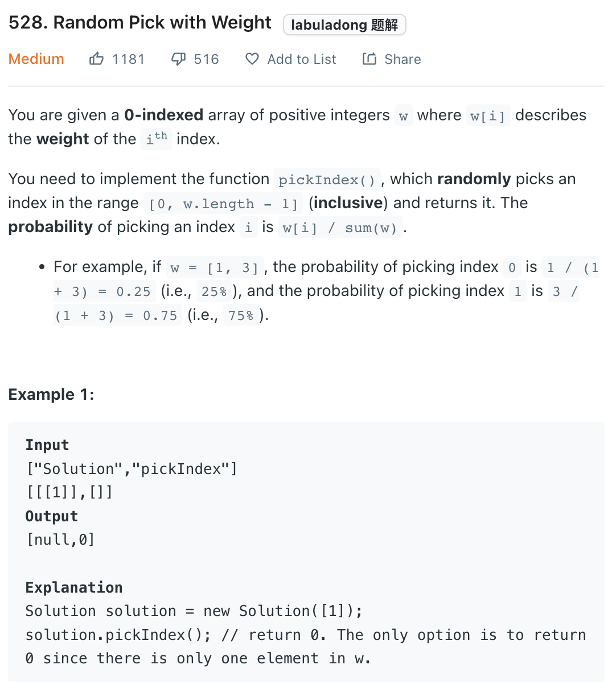
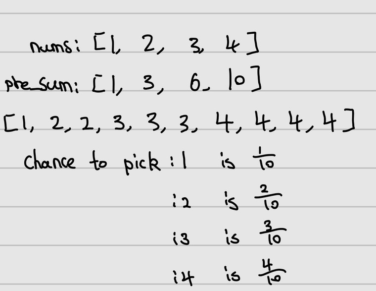

___
[528. Random Pick with Weight](https://leetcode.com/problems/random-pick-with-weight/)
___

## 分析问题
* This question is really abstract and require more math than coding.

## 基本思路
* 
* As you can see the image above.
* The chance of each num got picked is fixed.
* We can convert the input array to another form(second array above image).
* If we now random pick an index, it will follow the rules.
* But that way waste a lot of time and space.
* If we convert the input array into pre_sum form.
* `pre_sum[i]` mean we have `pre_sum[i]`'s chance to pick index `i` out of total sum.
* Inorder to optimize the search time, we can use binary search(becuase the `pre_sum` is in sorted order)

___

`Time complexity : O(log(n))`

`Space complexity : O(n)`
```python
class Solution:
    def __init__(self, w: List[int]):
        """
        :type w: List[int]
        """
        self.prefix_sums = []
        prefix_sum = 0
        for weight in w:
            prefix_sum += weight
            self.prefix_sums.append(prefix_sum)
        self.total_sum = prefix_sum

    def pickIndex(self) -> int:
        """
        :rtype: int
        """
        target = self.total_sum * random.random()
        # run a binary search to find the target zone
        low, high = 0, len(self.prefix_sums)
        while low <= high:
            mid = low + (high - low) // 2
            if target > self.prefix_sums[mid]:
                low = mid + 1
            else:
                high = mid - 1
        return low


# Your Solution object will be instantiated and called as such:
# obj = Solution(w)
# param_1 = obj.pickIndex()
```