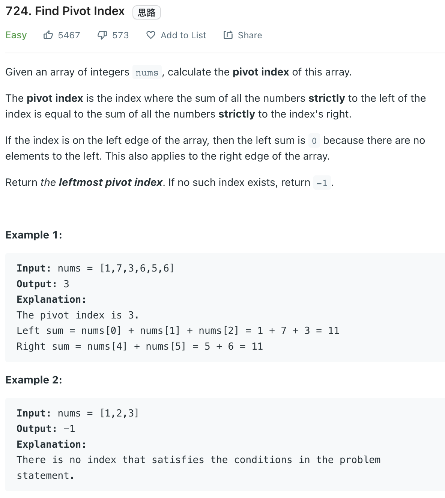

___
[724. Find Pivot Index](https://leetcode.com/problems/find-pivot-index/)
___

## 基本思路
* For example, the input is 
* Index:   `[0,  1,  2,  3,  4,   5]`
* Input:   `[1,  7,  3,  6,  5,   6]`
* Forward: `[1,  8,  11, 17, 22, 28]`
* Backward `[28, 27, 20, 17, 11,  6]`
* As we can see the answer is index 3
* There is another way that take constant space
* `totalSum - leftSum - currentNum == leftSum`
* For example, `totalSum` is 28
* We are at index 3
* `totalSum - leftSum - currentNum == leftSum`
* `28 - 11 - 6 == 11`

___

`Time complexity : O(n)`

`Space complexity : O(1)`
```python
class Solution:
    def pivotIndex(self, nums: List[int]) -> int: 
        totalSum = sum(nums)
        leftSum = 0
        
        for i, num in enumerate(nums):
            if leftSum == totalSum - leftSum - num:
                print(leftSum)
                return i
            leftSum += num
            
        return -1
```