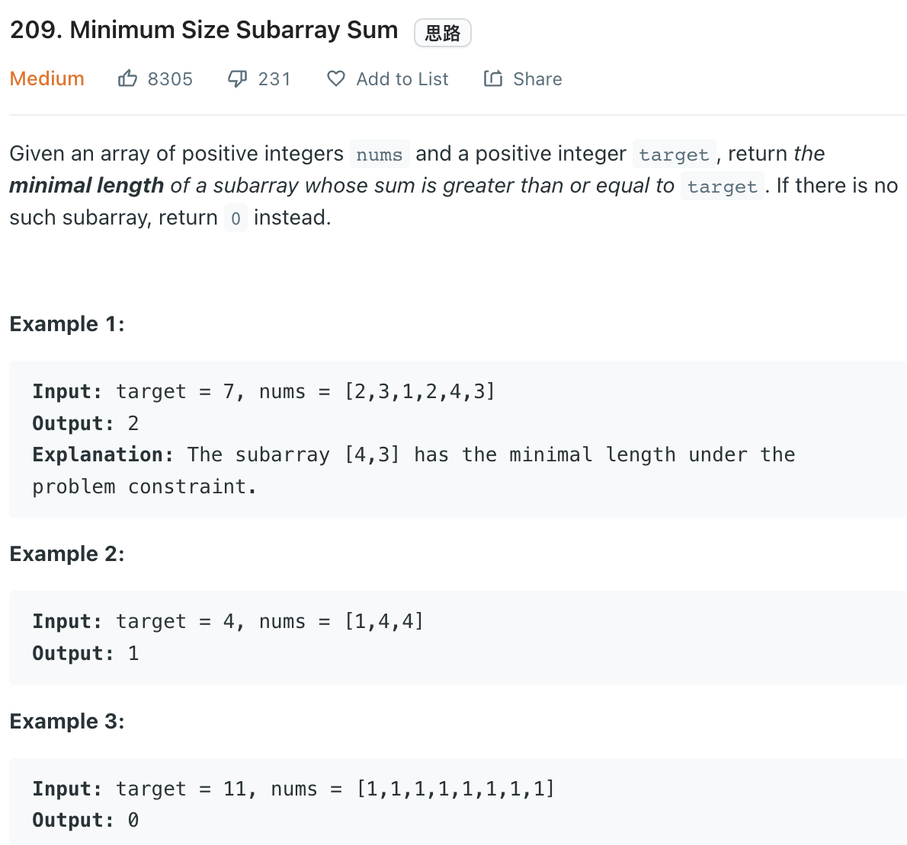

___
[209. Minimum Size Subarray Sum](https://leetcode.com/problems/minimum-size-subarray-sum/)
___


## 基本思路
* Sum all nums[left:right]
* While sum >= target, we move left

___

`Time complexity : O(n)`

`Space complexity : O(1)`
```python
class Solution:
    def minSubArrayLen(self, target: int, nums: List[int]) -> int:
        if sum(nums) < target:
            return 0
        
        minLength = len(nums)
        left = right = 0
        
        while right < len(nums):
            target -= nums[right]
            right += 1
            
            while target <= 0:
                minLength = min(right - left, minLength)
                target += nums[left]
                left += 1
                
                
        return minLength
```