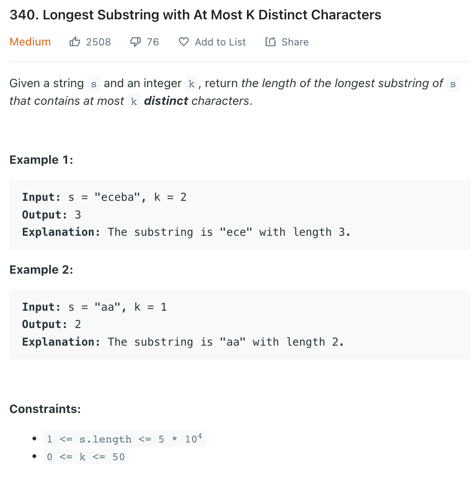

___
[340. Longest Substring with At Most K Distinct Characters](https://leetcode.com/problems/longest-substring-with-at-most-k-distinct-characters/)
___

## 基本思路
* 用sliding window 的模版就可以

___

`Time complexity : O(n)`

`Space complexity : O(k)`
```python
class Solution:
    def lengthOfLongestSubstringKDistinct(self, s: str, k: int) -> int:
        dic = {}
        length = len(s)
        left = right = 0
        answer = 0
        while right < length:
            char = s[right]
            right += 1
            dic[char] = dic.get(char, 0) + 1
            while len(dic) > k and left < right:
                char = s[left]
                if dic[char] > 1:
                    dic[char] = dic.get(char) - 1
                else:
                    del dic[char]
                left += 1
            answer = max(answer, right - left)
            
        return answer
```