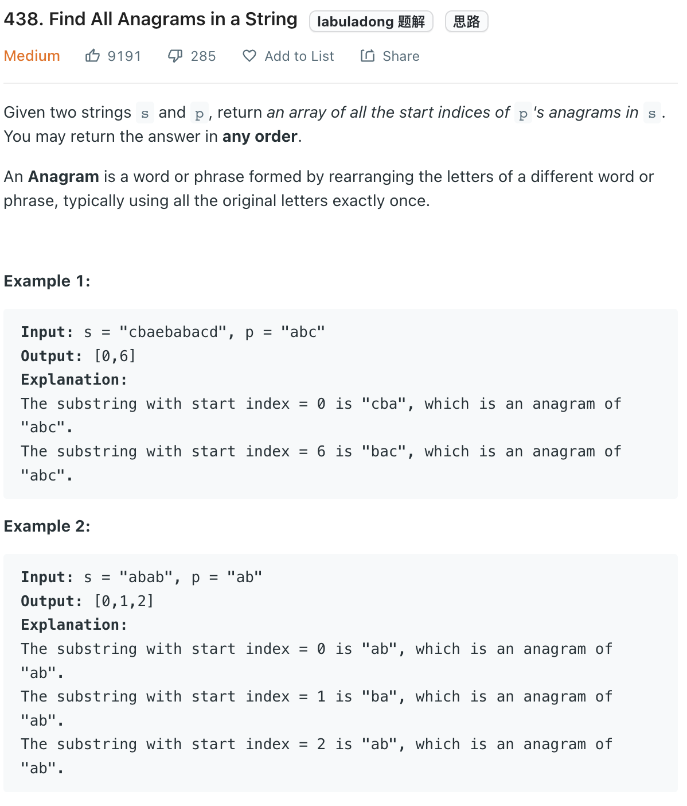

___
[438. Find All Anagrams in a String](https://leetcode.com/problems/find-all-anagrams-in-a-string/)
___


## 基本思路
* 

___

`Time complexity : O(n)`

`Space complexity : O(n)`
```python
class Solution:
    def findAnagrams(self, s: str, p: str) -> List[int]:
        need = collections.Counter(p)
        window = {}
        left = right = valid = 0
        answer = []
        
        while right < len(s):
            char = s[right]
            right += 1
            
            if char in need:
                window[char] = window.get(char, 0) + 1
                if window[char] == need[char]:
                    valid += 1
                    
            while right - left >= len(p):
                if valid == len(need):
                    answer.append(left)
                
                char = s[left]
                left += 1
                
                if char in need:
                    if window[char] == need[char]:
                        valid -= 1
                    window[char] -= 1
            
        return answer
```